# SkyForest — мобильное приложение: флоу и скриншоты UI

Документ для редизайна нативного приложения SkyForest (iOS / Android, Capacitor WebView).  
Содержит **все пользовательские флоу**, **маршруты экранов** и **актуальные скриншоты**.

> **Версия приложения:** 1.26.2 · **Платформа:** iPhone viewport 393×852 · **Язык скринов:** RU  
> **Папка со скринами:** [`mobile-ui-screenshots/`](./mobile-ui-screenshots/)

---

## Как пользоваться документом

1. Каждый экран имеет **ID**, **маршрут**, **назначение** и **скриншот** (если есть).
2. Экраны с несколькими состояниями (модалки, пустые/заполненные списки) описаны отдельно — для них нужен отдельный макет.
3. Экраны, помеченные «без скрина», — вторичные состояния; их можно сверстать по описанию или запросить доп. скрины.
4. **Не входит в native-меню**, но доступно по прямой ссылке: «Грибные туры», «Реферальная программа».

### Обновление скриншотов

```bash
cd skyforest
npm run dev -- --port 3001   # в отдельном терминале
node scripts/capture-mobile-ui-screenshots.mjs
```

---

## Навигация приложения

### Нижний таб-бар (только native)

| Таб | Маршрут | Назначение |
|-----|---------|------------|
| Главная | `/dashboard` | Карта локаций, быстрые действия по точке |
| Погода | `/dashboard/weather` | Архив погоды + карта осадков |
| **Определить гриб** (центр, accent) | `/dashboard/identify` | Фото → ML-идентификация |
| Мониторинг | `/dashboard/compare` | Сравнение с эталонным грибным днём |
| Трек | `/dashboard/track` | «Путь назад» из леса |

### Меню «☰» (шапка)

Главная · Погода · Мониторинг · Поиск леса · Определить гриб · Путь назад · Маркетплейс · **Токены** · Аккаунт · Мои локации · Мои грибные дни · **Разделы сайта** · Выйти

> В native **скрыты:** баланс токенов в шапке, «Грибные туры», «Пригласить друга».

### Глобальные оверлеи (не отдельные маршруты)

| Оверлей | Когда показывается | Скрин |
|---------|-------------------|-------|
| Native Splash | Холодный старт ~1.5 с | [`reference/ios.png`](./mobile-ui-screenshots/reference/ios.png) (маркетинг + системный диалог) |
| Biometric Lock | Face ID / Touch ID при старте и возврате из фона | *нет скрина — полноэкранный тёмно-зелёный экран «Unlock»* |
| TokenConfirmModal | Перед списанием токенов | *см. описание в соответствующих флоу* |
| Toast-уведомления | Успех / ошибка операций | *стандартный Sonner, top-right* |

---

## Флоу 1. Запуск и авторизация

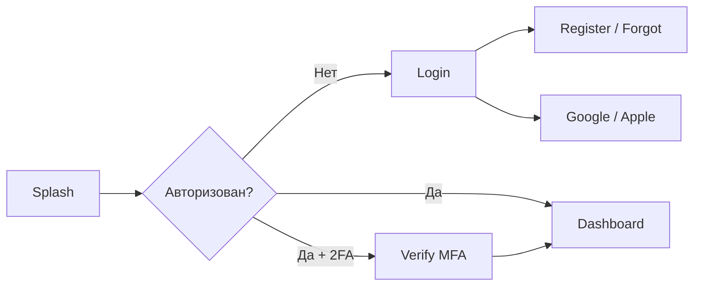
```mermaid
flowchart LR
  A[Splash] --> B{Авторизован?}
  B -->|Нет| C[Login]
  C --> D[Register / Forgot]
  C --> E[Google / Apple]
  B -->|Да + 2FA| F[Verify MFA]
  B -->|Да| G[Dashboard]
  F --> G
```

### 1.1 Splash (native)

| | |
|---|---|
| **ID** | `splash` |
| **Маршрут** | — (оверлей при старте) |
| **Элементы** | Логотип 128px, подпись «Идём за грибами!», фон `#0f1a12` |
| **Скрин** | Маркетинговый лендинг + системный диалог push: [`reference/ios.png`](./mobile-ui-screenshots/reference/ios.png) |

### 1.2 Вход

| | |
|---|---|
| **ID** | `01-login` |
| **Маршрут** | `/login` |
| **Элементы** | Логотип · Google / Apple · email + пароль · «Забыли пароль?» · «Зарегистрироваться» |
| **Native-отличия** | Тёмный full-screen layout, соц-кнопки сверху |
| **Скрин** | 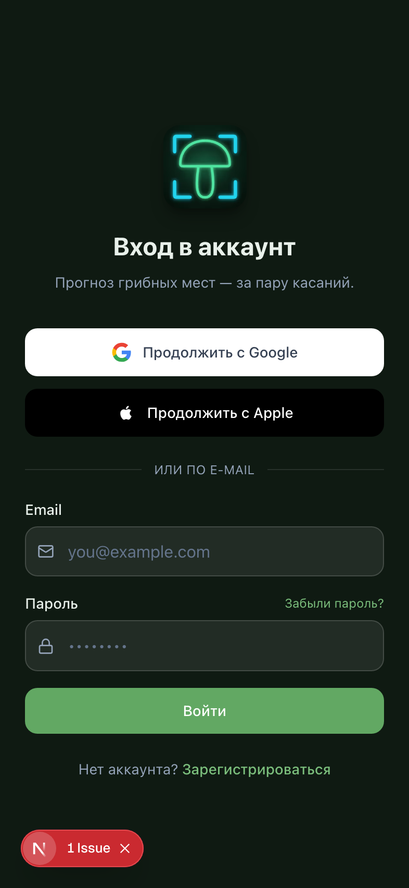 |

### 1.3 Регистрация

| | |
|---|---|
| **ID** | `02-register` |
| **Маршрут** | `/register` |
| **Скрин** | 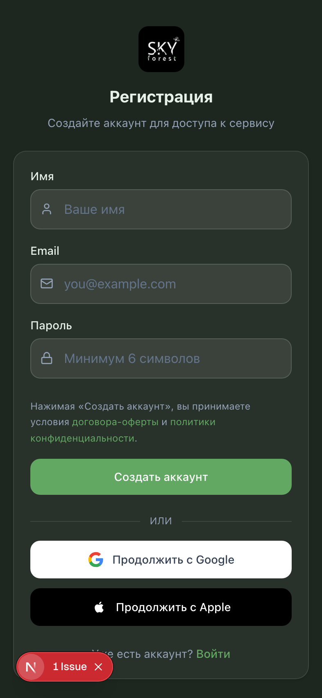 |

### 1.4 Восстановление пароля

| | |
|---|---|
| **ID** | `03-forgot-password` |
| **Маршрут** | `/forgot-password` |
| **Скрин** | 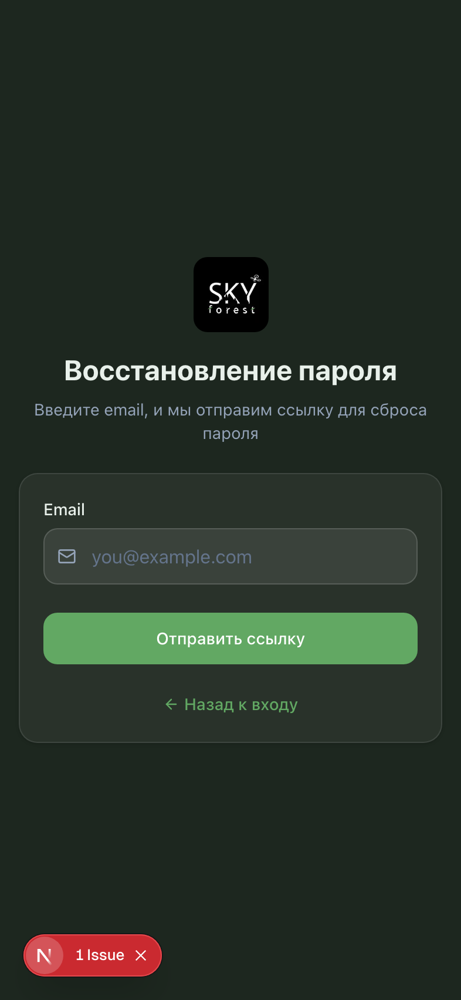 |

### 1.5 Новый пароль (невалидная ссылка)

| | |
|---|---|
| **ID** | `04-reset-password` |
| **Маршрут** | `/reset-password` |
| **Состояние на скрине** | Ошибка «ссылка недействительна» |
| **Скрин** | 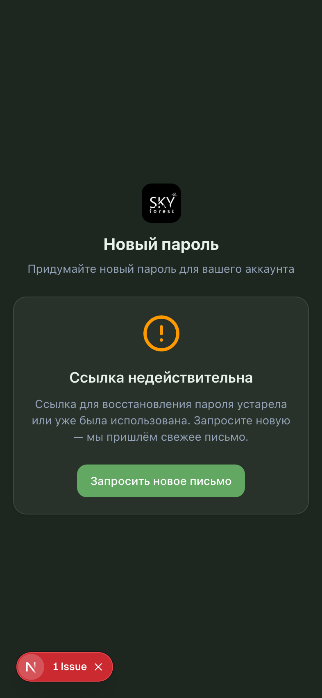 |

### 1.6 Двухфакторная проверка

| | |
|---|---|
| **ID** | — |
| **Маршрут** | `/verify-mfa` |
| **Элементы** | Поле TOTP · подтверждение |
| **Скрин** | *не снят — нужен аккаунт с включённым 2FA* |

---

## Флоу 2. Главная (Dashboard)

**Цель:** быстро выбрать точку на карте → погода / карта дождя / тип леса / сохранить локацию.

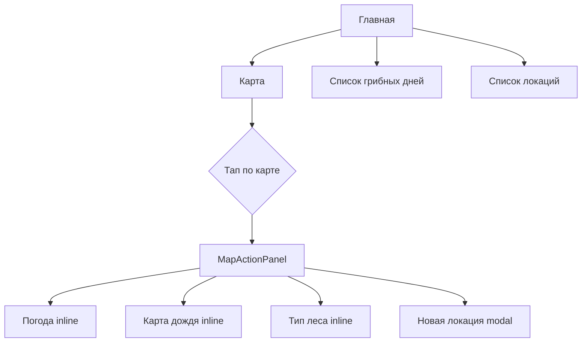
```mermaid
flowchart TD
  H[Главная] --> M[Карта]
  M --> T{Тап по карте}
  T --> P[MapActionPanel]
  P --> W[Погода inline]
  P --> R[Карта дождя inline]
  P --> F[Тип леса inline]
  P --> L[Новая локация modal]
  H --> BD[Список грибных дней]
  H --> LOC[Список локаций]
```

> **Native vs Web:** на native нет welcome-блока, карточек фич и бота — только карта + панель действий + списки (если есть данные).

### 2.1 Главная — карта (native, пустой аккаунт)

| | |
|---|---|
| **ID** | `10-dashboard-native` |
| **Маршрут** | `/dashboard` |
| **Заголовок** | «Добро пожаловать в SkyForest AI» |
| **Подзаголовок** | «Нажмите на карту, чтобы узнать прогноз погоды или тип леса» |
| **Элементы** | Карта · легенда (локации / грибные дни) · MapActionPanel · таб-бар |
| **Скрин (iOS simulator)** | 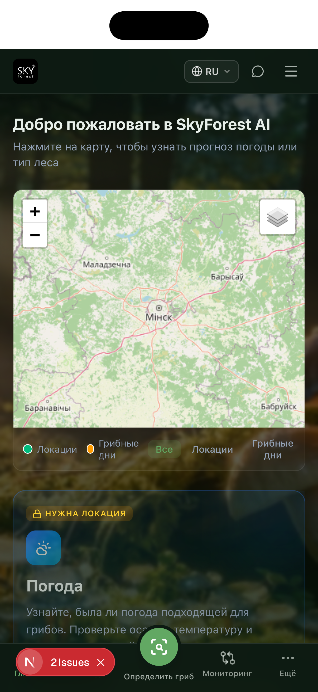 |

### 2.2 Главная — выбор точки на карте

| | |
|---|---|
| **Состояние** | Пользователь тапнул по карте, точка не сохранена |
| **MapActionPanel** | «Нажмите на карту…» → кнопки **Погода · Карта дождя · Лес** (неактивны до выбора) |
| **Скрин** | [`reference/home2.png`](./mobile-ui-screenshots/reference/home2.png) |

### 2.3 Главная — точка выбрана

| | |
|---|---|
| **Состояние** | Координаты выбраны, кнопки активны |
| **Скрин** | [`reference/home3.png`](./mobile-ui-screenshots/reference/home3.png) · [`reference/home5.png`](./mobile-ui-screenshots/reference/home5.png) |

### 2.4 Главная — блок «Мои локации»

| | |
|---|---|
| **Состояние** | Есть сохранённые локации |
| **Элементы** | Заголовок · «+ Добавить» · chips локаций |
| **Скрин** | [`reference/home3.png`](./mobile-ui-screenshots/reference/home3.png) |

### 2.5 Главная — onboarding (web-версия, для справки)

| | |
|---|---|
| **ID** | `10-dashboard-web` |
| **Примечание** | В **native** онбординг «С чего начать?» перенесён на `/dashboard/compare` |
| **Скрин (web layout)** | [`reference/dashboard.png`](./mobile-ui-screenshots/reference/dashboard.png) · [`10-dashboard.png`](./mobile-ui-screenshots/10-dashboard.png) |

### 2.6 Боковое меню

| | |
|---|---|
| **ID** | `11-dashboard-menu` |
| **Маршрут** | `/dashboard` + tap ☰ |
| **Скрин** | 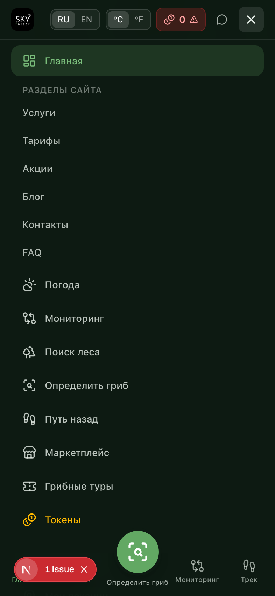 |

### 2.7 Модалка «Новая локация»

| | |
|---|---|
| **Компонент** | `NewLocationModal` |
| **Триггер** | Сохранение точки с карты / best-day flow |
| **Элементы** | Название · координаты · сложность · сохранить |
| **Скрин** | *не снят — открывается поверх карты* |

### 2.8 Модалка подтверждения токенов

| | |
|---|---|
| **Компонент** | `TokenConfirmModal` |
| **Варианты текста** | «Проверить погоду?» · «Построить карту дождя?» · «Узнать тип леса?» |
| **Элементы** | Стоимость в токенах · Подтвердить / Отмена |
| **Скрин** | *не снят* |

---

## Флоу 3. Локации

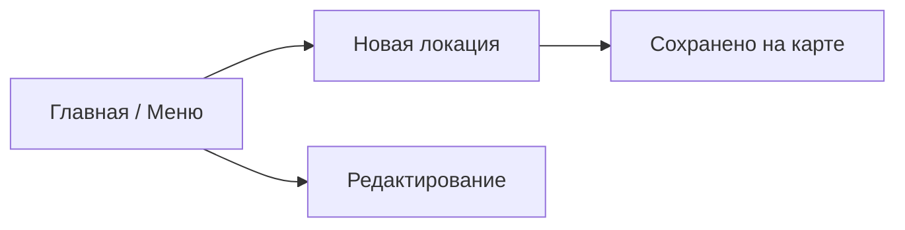
```mermaid
flowchart LR
  A[Главная / Меню] --> B[Новая локация]
  A --> C[Редактирование]
  B --> D[Сохранено на карте]
```

### 3.1 Новая локация

| | |
|---|---|
| **ID** | `23-locations-new` |
| **Маршрут** | `/dashboard/locations/new` |
| **Элементы** | Название · карта · pin · сложность · «Сохранить» (бесплатно) |
| **Скрин** | 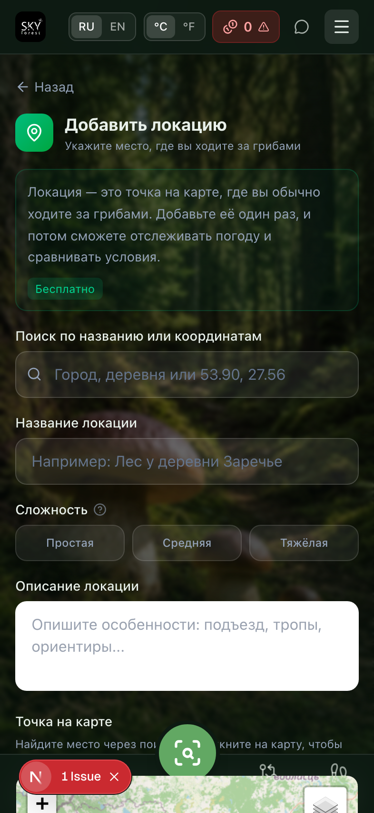 |

### 3.2 Редактирование локации

| | |
|---|---|
| **ID** | — |
| **Маршрут** | `/dashboard/locations/[id]` |
| **Элементы** | Edit form · удалить · координаты на карте |
| **Скрин** | *не снят — нужна сохранённая локация* |

---

## Флоу 4. Грибные дни (Best Day)

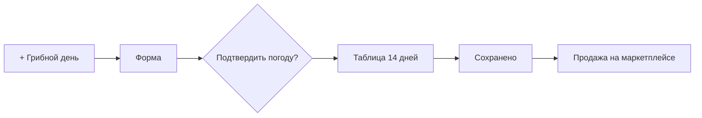
```mermaid
flowchart LR
  A[+ Грибной день] --> B[Форма]
  B --> C{Подтвердить погоду?}
  C --> D[Таблица 14 дней]
  D --> E[Сохранено]
  E --> F[Продажа на маркетплейсе]
```

### 4.1 Новый грибной день

| | |
|---|---|
| **ID** | `24-best-day-new` |
| **Маршрут** | `/dashboard/best-day/new` |
| **Элементы** | Название · дата · локация · вид гриба · загрузка погоды (2 т.) |
| **Скрин** | 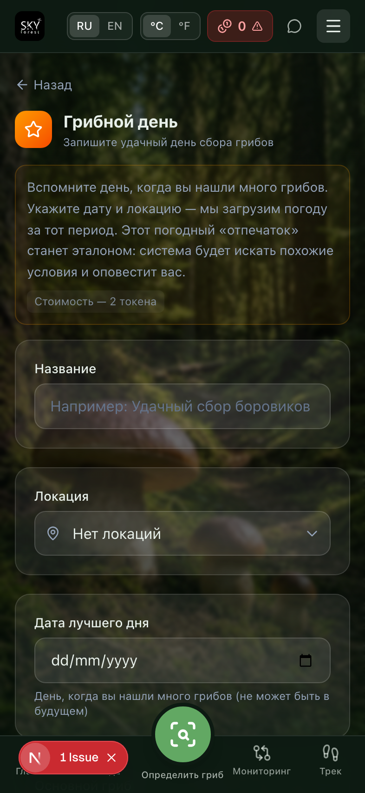 |

### 4.2 Редактирование грибного дня

| | |
|---|---|
| **Маршрут** | `/dashboard/best-day/[id]` |
| **Элементы** | Edit · мониторинг · «Выставить на маркетплейс» |
| **Скрин** | *не снят* |

### 4.3 Модалка продажи на маркетплейсе

| | |
|---|---|
| **Компонент** | `SellBestDayModal` |
| **Элементы** | Цена · комиссия · превью · «Выставить» |
| **Скрин** | *не снят* |

---

## Флоу 5. Погода

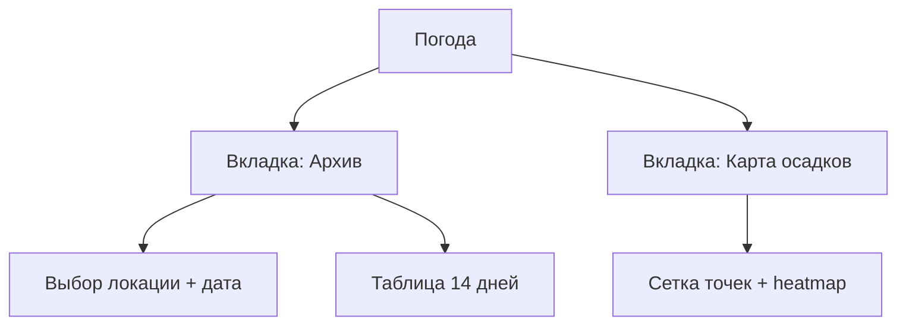
```mermaid
flowchart TD
  W[Погода] --> T1[Вкладка: Архив]
  W --> T2[Вкладка: Карта осадков]
  T1 --> L[Выбор локации + дата]
  T1 --> H[Таблица 14 дней]
  T2 --> G[Сетка точек + heatmap]
```

### 5.1 Погода — архив

| | |
|---|---|
| **ID** | `12-weather` |
| **Маршрут** | `/dashboard/weather` |
| **Стоимость** | 4 токена за загрузку |
| **Скрин** | 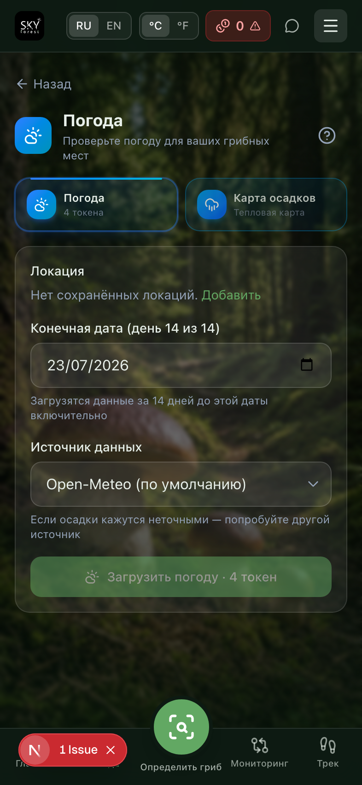 |

### 5.2 Карта осадков

| | |
|---|---|
| **ID** | `13-rain-map` |
| **Маршрут** | `/dashboard/weather?tab=rain-map` |
| **Стоимость** | 10 токенов (50 точек) |
| **Скрин** | 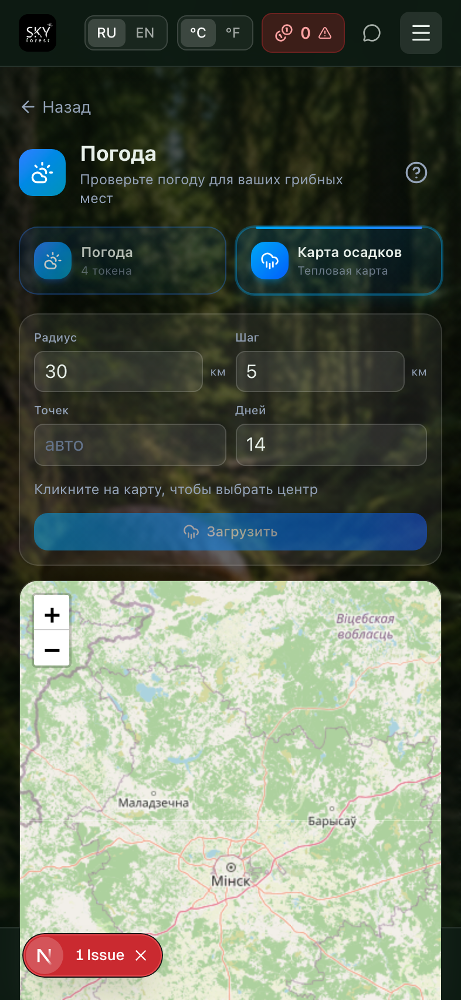 |

### 5.3 Inline-погода с главной

| | |
|---|---|
| **Где** | MapActionPanel на `/dashboard` |
| **Стоимость** | 4 токена |
| **Скрин** | *не снят — результат под карточкой на главной* |

---

## Флоу 6. Определение гриба по фото

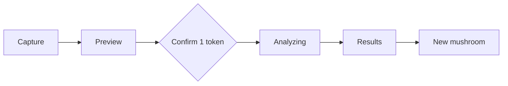
```mermaid
flowchart LR
  A[Capture] --> B[Preview]
  B --> C{Confirm 1 token}
  C --> D[Analyzing]
  D --> E[Results]
  E --> F[New mushroom]
```

### 6.1 Начальный экран

| | |
|---|---|
| **ID** | `14-identify` |
| **Маршрут** | `/dashboard/identify` |
| **Элементы** | Советы по фото · «Сделать фото» · «Выбрать из галереи» |
| **Скрин** | 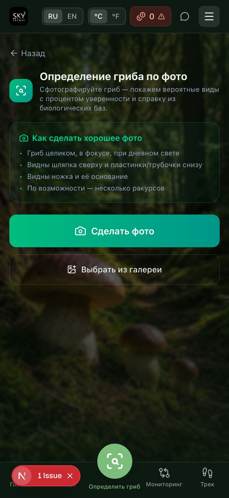 |

### 6.2 Превью фото

| | |
|---|---|
| **Состояние** | Фото выбрано, до отправки |
| **Элементы** | Preview · «Определить · 1 токен» · «Переснять» |
| **Скрин** | *не снят* |

### 6.3 Результаты идентификации

| | |
|---|---|
| **Состояние** | После ML-анализа |
| **Элементы** | Top matches % · habitat · lookalikes · checklist · disclaimer |
| **Скрин** | *не снят — нужно фото гриба + токены* |

---

## Флоу 7. Мониторинг (Compare)

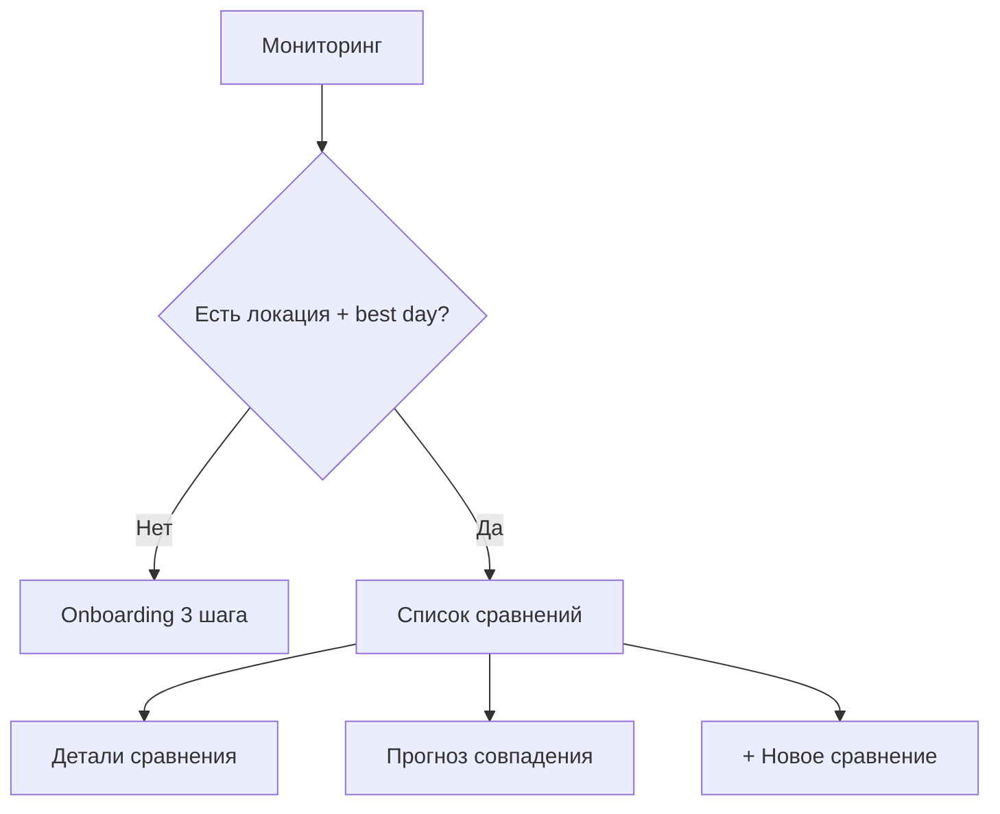
```mermaid
flowchart TD
  C[Мониторинг] --> O{Есть локация + best day?}
  O -->|Нет| OB[Onboarding 3 шага]
  O -->|Да| L[Список сравнений]
  L --> D[Детали сравнения]
  L --> F[Прогноз совпадения]
  L --> N[+ Новое сравнение]
```

### 7.1 Список / onboarding

| | |
|---|---|
| **ID** | `15-compare` |
| **Маршрут** | `/dashboard/compare` |
| **Native onboarding** | «С чего начать?» — если нет локаций или грибных дней |
| **Скрин** | 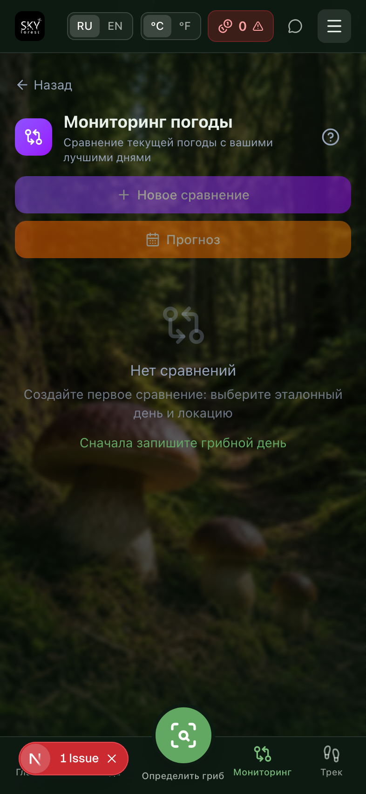 |

### 7.2 Детали сравнения (overlay)

| | |
|---|---|
| **Состояние** | Открыто сохранённое сравнение |
| **Элементы** | Score · параметры · «Сравнить сейчас» · автосравнение |
| **Скрин** | *не снят* |

### 7.3 Прогноз совпадения

| | |
|---|---|
| **Элементы** | 6 временных окон · «Рассчитать · N т.» · разбивка по дням |
| **Скрин** | *не снят* |

---

## Флоу 8. Трек («Путь назад»)

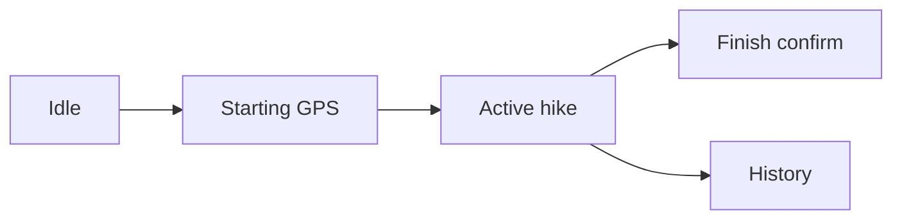
```mermaid
flowchart LR
  I[Idle] --> S[Starting GPS]
  S --> A[Active hike]
  A --> F[Finish confirm]
  A --> H[History]
```

### 8.1 Начальное состояние

| | |
|---|---|
| **ID** | `16-track` |
| **Маршрут** | `/dashboard/track` |
| **Элементы** | «Я вошёл в лес» · «Как это работает» |
| **Скрин** | 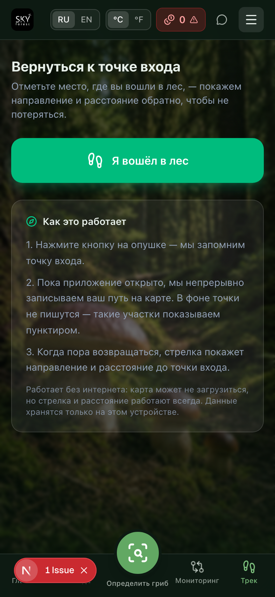 |

### 8.2 Активный поход

| | |
|---|---|
| **Состояние** | GPS-якорь установлен |
| **Элементы** | Расстояние до входа · компас/стрелка · карта · длительность · «Завершить» |
| **Скрин** | *не снят — нужен GPS / симулятор* |

### 8.3 История треков

| | |
|---|---|
| **Компонент** | `TrackHistory` |
| **Скрин** | *не снят* |

---

## Флоу 9. Поиск леса

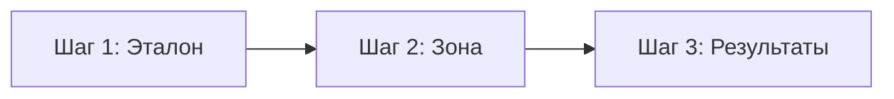
```mermaid
flowchart LR
  S1[Шаг 1: Эталон] --> S2[Шаг 2: Зона]
  S2 --> S3[Шаг 3: Результаты]
```

### 9.1 Поиск леса — шаг 1

| | |
|---|---|
| **ID** | `20-forest-search` |
| **Маршрут** | `/dashboard/forest-search` |
| **Элементы** | 3-step wizard · карта · эталонный паттерн (10 точек) |
| **Скрин** | 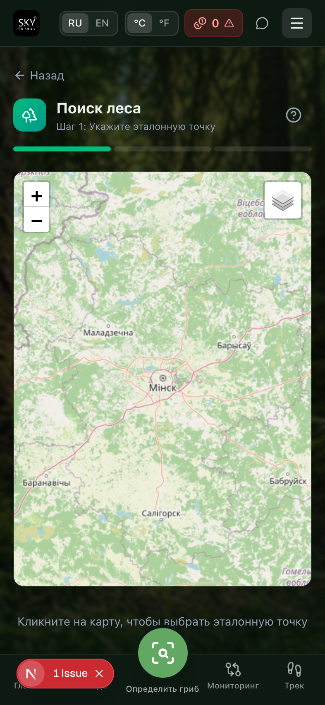 |

### 9.2 Шаги 2–3

| | |
|---|---|
| **Шаг 2** | Центр поиска + радиус |
| **Шаг 3** | Ранжированные массивы · погода · сохранить как локацию |
| **Скрин** | *не снят — нужно пройти wizard* |

---

## Флоу 10. Маркетплейс

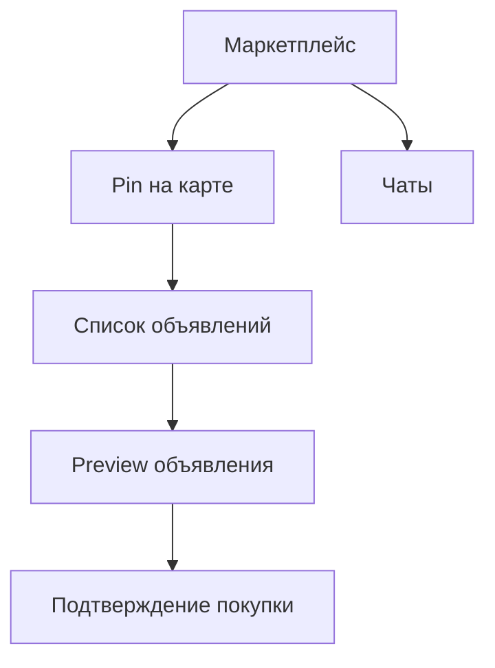
```mermaid
flowchart TD
  M[Маркетплейс] --> P[Pin на карте]
  P --> R[Список объявлений]
  R --> V[Preview объявления]
  V --> B[Подтверждение покупки]
  M --> CH[Чаты]
```

### 10.1 Карта маркетплейса

| | |
|---|---|
| **ID** | `21-marketplace` |
| **Маршрут** | `/dashboard/marketplace` |
| **Элементы** | Карта · pin · радиус · фильтры · карточки |
| **Скрин** | 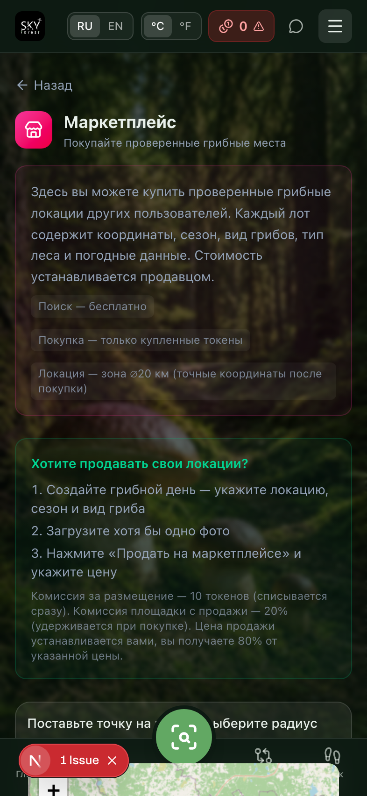 |

### 10.2 Чаты

| | |
|---|---|
| **ID** | `22-chats` |
| **Маршрут** | `/dashboard/marketplace/chats` |
| **Состояния** | Пустой inbox · список · активный диалог |
| **Скрин (пустой)** | 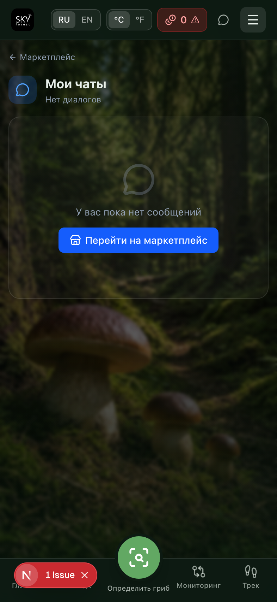 |

### 10.3 Preview / покупка / фото

| | |
|---|---|
| **Модалки** | Listing preview · Buy confirm · Mushroom info · Fullscreen photo |
| **Скрин** | *не снят* |

---

## Флоу 11. Аккаунт и безопасность

### 11.1 Мой аккаунт

| | |
|---|---|
| **ID** | `25-account` |
| **Маршрут** | `/account` |
| **Секции** | Профиль · пароль · 2FA · App Lock (native) · токены · история · удаление |
| **Скрин** | 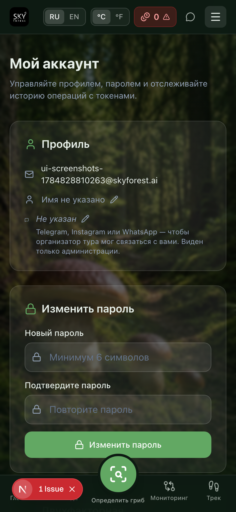 |

### 11.2 App Lock (native only)

| | |
|---|---|
| **Компонент** | `BiometricLockSetting` + `BiometricLockGate` |
| **Элементы** | Toggle в аккаунте · полноэкранный unlock |
| **Скрин** | *не снят* |

### 11.3 Удаление аккаунта

| | |
|---|---|
| **Состояния** | Confirm modal · cooldown banner |
| **Скрин** | *не снят* |

---

## Флоу 12. Токены и подписки (IAP)

> В native: только **In-App Purchase** (Apple / Google). Web-checkout, промокоды и вывод **скрыты**.

### 12.1 Покупка токенов

| | |
|---|---|
| **ID** | `26-payment` |
| **Маршрут** | `/payment` |
| **Элементы** | Пакеты токенов · цены из App Store · таблица стоимости операций |
| **Скрин** | 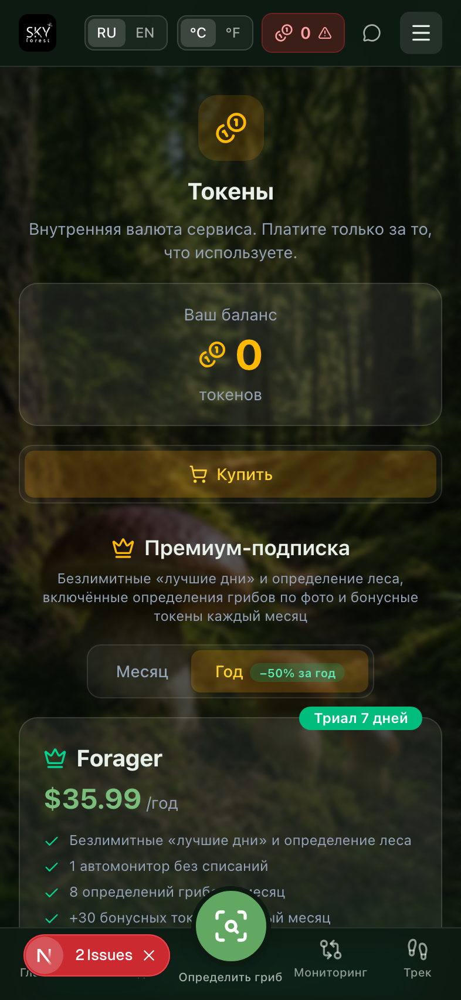 |

### 12.2 Подписки Premium

| | |
|---|---|
| **ID** | `27-payment-subscriptions` |
| **Маршрут** | `/payment#subscriptions` |
| **Элементы** | Forager / Pro · monthly/yearly · trial · EULA + Privacy links |
| **Скрин** | 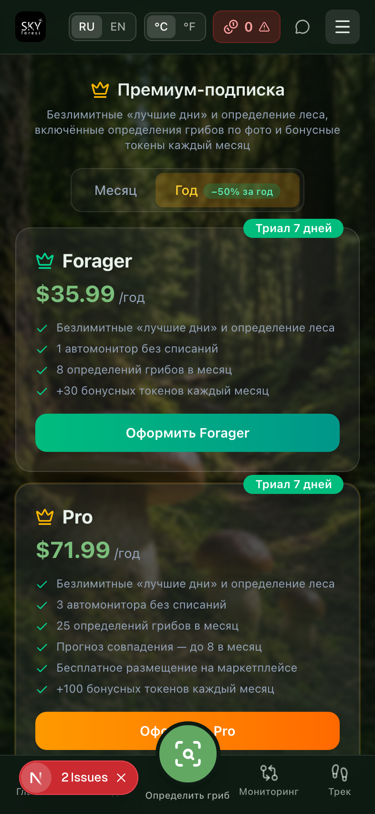 |

### 12.3 Web-only (не показывать в native-дизайне)

| Маршрут | Назначение |
|---------|------------|
| `/payment?tab=withdraw` | Вывод токенов |
| `/dashboard/withdraw` | Standalone withdraw |
| `/dashboard/referral` | Реферальная программа |

---

## Флоу 13. Разделы сайта (marketing)

Доступны из native-меню в группе **«Разделы сайта»**. Layout без таб-бара.

| ID | Маршрут | Название | Скрин |
|----|---------|----------|-------|
| `30-services` | `/services` | Услуги | 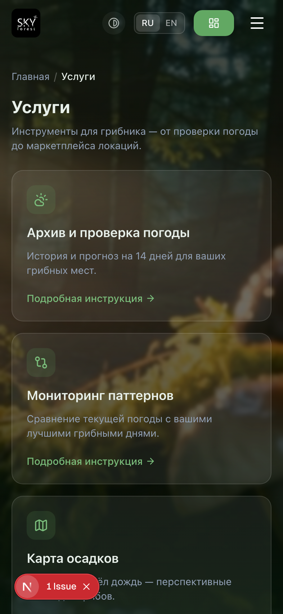 |
| `31-promotions` | `/promotions` | Акции | 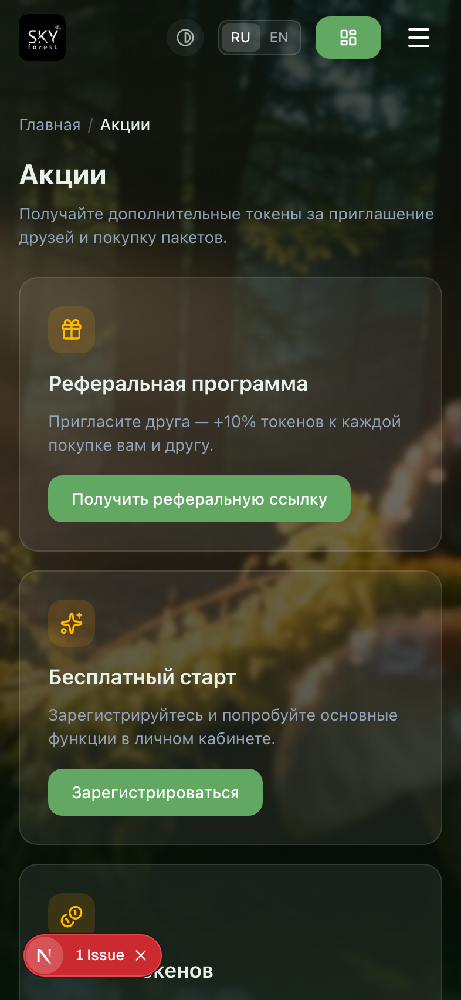 |
| `32-blog` | `/blog` | Блог (индекс) | 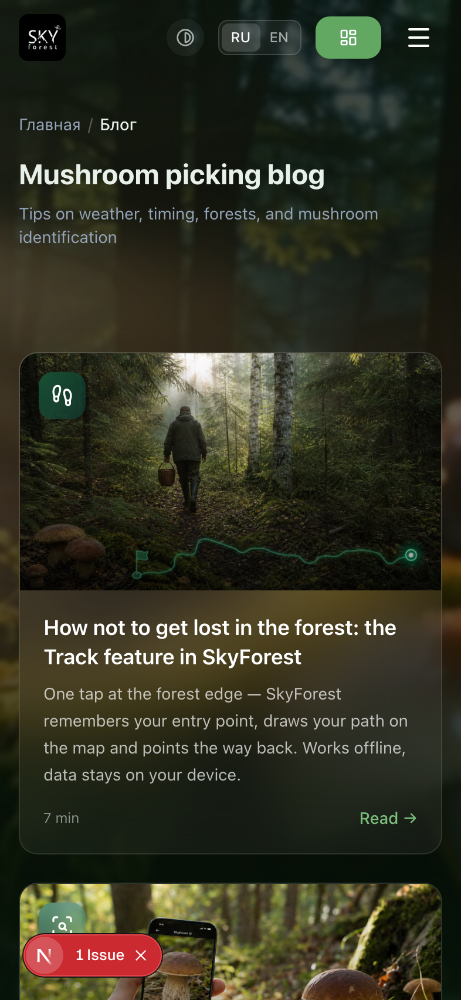 |
| `33-contacts` | `/contacts` | Контакты | 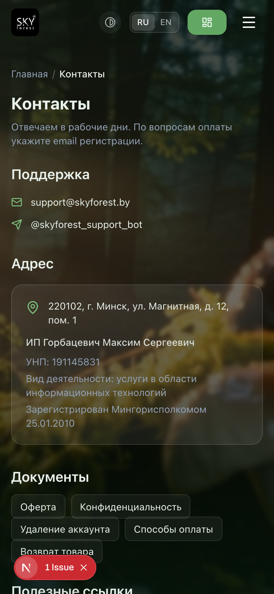 |

### Юридические страницы (ссылки из payment / footer)

| ID | Маршрут | Скрин |
|----|---------|-------|
| `34-offer` | `/offer` | 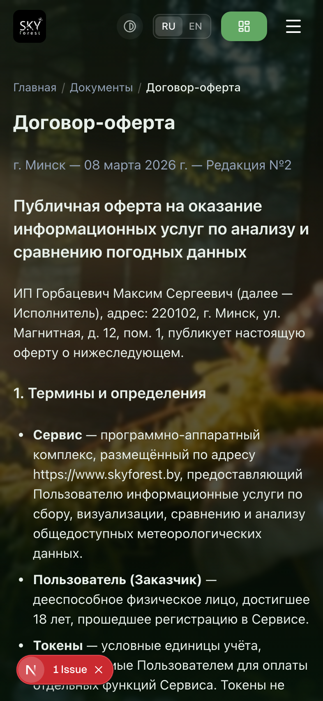 |
| `35-privacy` | `/privacy` | 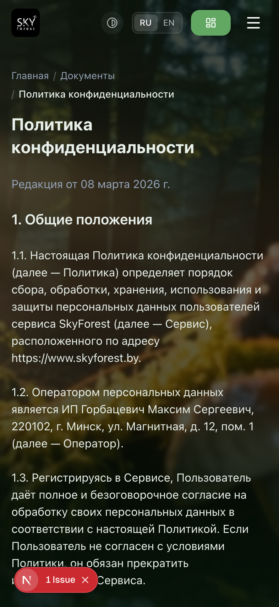 |

---

## Флоу 14. Грибные туры (аукцион) — скрыто в native-меню

> Маршруты работают, но **пункт меню скрыт** в iOS/Android. Дизайн нужен, если вернёте в меню.

| Маршрут | Экран | Фазы |
|---------|-------|------|
| `/dashboard/mushroom-tours` | Список туров | — |
| `/dashboard/mushroom-tours/[id]` | Зал аукциона | announced → upcoming → live → finished |

**Скрины:** *не сняты*

---

## Флоу 15. Админ (только admin-аккаунт)

| | |
|---|---|
| **Маршрут** | `/dashboard/admin` |
| **Элементы** | Sidebar tabs · users · tours · listings · withdrawals |
| **Скрин** | *не снят — не входит в пользовательский редизайн* |

---

## Design tokens (текущие)

| Token | Значение | Где |
|-------|----------|-----|
| Background | `#0f1a12` / `#0d1a12` | Splash, header, tab bar |
| Primary | `#62a863` (primary-light) | CTA, accent tab |
| Glass cards | `bg-white/5` + blur | Карточки, меню |
| Tab bar height | ~5.5rem + safe-area | `AppShell` padding-bottom |
| Accent button | 68px circle, `-mt-9` | «Определить гриб» |
| Font | System sans (Tailwind default) | — |
| Native background | `/images/app-bg-forest.png` (static) | vs video on web |

---

## Чеклист для дизайнера

- [ ] **5 табов** + центральная accent-кнопка
- [ ] **Hamburger menu** (длинный scroll + «Разделы сайта»)
- [ ] **Auth flow** (4 экрана + splash + biometric)
- [ ] **Dashboard native** (карта-first, не web-карточки)
- [ ] **MapActionPanel** + inline weather/rain/forest
- [ ] **Identify flow** (4+ состояния)
- [ ] **Compare / Track / Forest search** wizards
- [ ] **Marketplace** map + chats + modals
- [ ] **Payment IAP** packs + subscriptions + legal links
- [ ] **Account** + App Lock toggle
- [ ] **Token confirm modals** (единый паттерн)
- [ ] **Empty states** для нового пользователя
- [ ] **Dark theme** + forest imagery

---

## Файлы в репозитории

```
docs/
├── MOBILE_APP_UI_FLOWS.md          ← этот документ
└── mobile-ui-screenshots/
    ├── 01-login.png … 35-privacy.png   ← автоматические скрины
    ├── manifest.json                   ← метаданные скринов
    └── reference/
        ├── home.png … home5.png        ← iOS simulator, native home states
        ├── dashboard.png               ← web-layout onboarding (справочно)
        └── ios.png                     ← splash / marketing
scripts/
└── capture-mobile-ui-screenshots.mjs   ← пересъёмка
```
