# Mushroom Checker — все экраны и флоу (основа для редизайна)

Скриншоты: `docs/ui-flows/checker/` · снято скриптом `scripts/capture-ui-flows.mjs`
(Playwright, iPhone 14 Pro 393×852 @2x, тёмная тема, симуляция нативной оболочки iOS,
боевой хост `https://checker.skyforest.ai`).

> **Язык на скриншотах — английский.** На домене `*.skyforest.ai` `defaultLocale` = `en`
> (см. `src/i18n/brand-locale.ts`), а `localePrefix: "as-needed"`, поэтому без префикса
> `/ru` отдаётся английская версия. Русская версия — те же экраны по адресам `/ru/...`.
> В тексте ниже названия элементов даны как в интерфейсе (английские), в скобках —
> русский вариант из `src/i18n/messages/*.ru.ts`.

---

## 1. Что это за приложение

**Mushroom Checker** — «одноэкранное» приложение: распознавание гриба по фотографии
с оценкой уверенности, опасными двойниками и справкой из биологических баз.
Всё остальное (погода, карты, маркетплейс, туры SkyForest) в этом флейворе
недоступно.

- **Аудитория:** грибники-любители, которым нужно быстро проверить находку;
  в первую очередь мобильные пользователи (iOS/Android, нативная оболочка Capacitor).
- **Цель продукта:** платная подписка **Mushroom Checker Premium** (25 распознаваний
  в месяц) с 7-дневным триалом; покупка только через App Store / Google Play.
- **Технически** это не отдельная кодовая база, а «флейвор» SkyForest: тот же
  Next.js-инстанс, флейвор определяется хостом (`src/lib/appFlavor.ts`),
  middleware обрезает маршруты, навигация и оплата подстраиваются под флейвор.
  Нативный `appId` — `ai.skyforest.mushroomchecker`.

### Ключевые ограничения флейвора (`FLAVORS.checker` в `src/lib/appFlavor.ts`)

| Параметр | Значение |
| --- | --- |
| `homePath` | `/dashboard/identify` |
| `allowedPaths` | `/login`, `/register`, `/forgot-password`, `/reset-password`, `/verify-mfa`, `/account`, `/privacy`, `/delete-account`, `/landing`, `/dashboard/identify`, `/payment`, `/offer` |
| `anonymousPaths` | — (пусто: распознавание только после входа) |
| `navHrefs` | `["/dashboard/identify"]` → нижний таб-бар **не рендерится** (`NativeTabBar` скрывает себя при < 2 табах) |
| `showTokens` | `false` — баланс токенов в шапке скрыт |
| манифест / иконка | `/manifest-checker.webmanifest`, `/icons/checker-192.png` |

---

## 2. Карта экранов

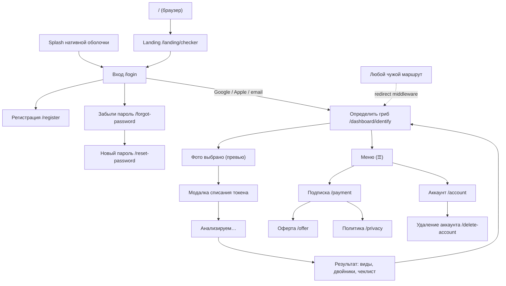

Переходы, которые задаются не UI, а `src/middleware.ts`:

- `/` на поддомене → **rewrite** на `/{locale}/landing/checker` (адрес остаётся `/`);
- любой путь вне `allowedPaths` → **redirect** на `/dashboard/identify`;
- защищённый путь без сессии → `/login?redirect=...`;
- `/login` при активной сессии → `/dashboard/identify`;
- включённый TOTP → `/verify-mfa` после ввода пароля.

---

## 3. Экраны

### 3.1 Splash нативной оболочки

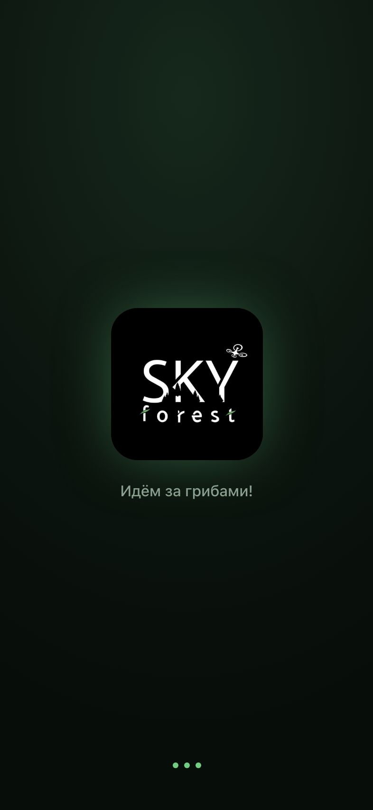

- **Маршрут:** нет — оверлей поверх любого экрана при холодном старте.
- **Файл:** `src/components/native/NativeSplash.tsx` (+ нативный splash Capacitor,
  `launchAutoHide: false`).
- **Назначение:** перекрыть загрузку боевого сайта в WebView, чтобы не мелькал
  пустой белый экран.
- **Элементы:** иконка флейвора `public/icons/checker-512.png` (анимация
  `animate-sf-float`), название **Mushroom Checker**, таглайн
  `flavor.checker.tagline`, три пульсирующие точки.
- **Тайминги:** видим 1300 мс → затухание 500 мс; страховка 3000 мс, если логотип
  не загрузился. Показывается один раз за загрузку документа (module-level `shownOnce`).
- **Данные:** нет.
- **Переход:** дальше `NativeAppProvider` уводит на `/dashboard/identify` или `/login`.
- **История:** до v1.41.0 здесь был логотип SkyForest — приложение открывалось
  «чужим» брендом.

### 3.2 Посадочная страница (только браузер)

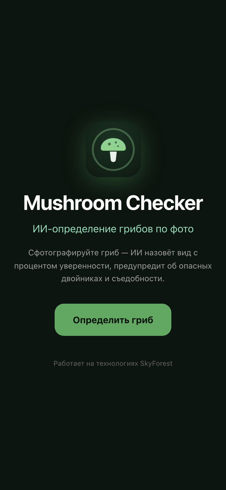

- **Маршрут:** `/` (rewrite на `/{locale}/landing/checker`).
- **Файл:** `src/app/[locale]/landing/checker/page.tsx`.
- **Назначение:** объяснить продукт и увести в стор/на вход. В нативной оболочке
  недостижима: `NativeAppProvider` сразу редиректит с `/`.
- **Элементы:** заголовок, описание, кнопки перехода на вход/регистрацию,
  ссылки на оферту и политику.
- **Данные:** статика + `next-intl`.

### 3.3 Вход


- **Маршрут:** `/login` (`?redirect=` — куда вернуться после входа).
- **Файл:** `src/app/[locale]/(auth)/login/page.tsx` — **две разные разметки**:
  `if (isNative)` (на скриншоте) и веб-вариант ниже в том же файле.
- **Элементы:**
  - иконка Mushroom Checker 76×76 (`AuthBrandMark mode="native-hero"`; в
    SkyForest на этом месте по-прежнему глиф `ScanSearch`) и подзаголовок
    `flavor.checker.authSubtitle`;
  - **Continue with Google** / **Continue with Apple** — `src/components/auth/SocialLoginButtons.tsx`,
    OAuth через Supabase; вынесены **выше** email-формы (в нативе это основной путь);
  - разделитель `OR WITH EMAIL` (`auth.orWithEmail`);
  - поля **Email** и **Password** (иконки `Mail`/`Lock`, `minLength=6`);
  - ссылка **Forgot password?** → `/forgot-password`;
  - кнопка **Sign in** (`btn-primary`, спиннер `Loader2` при отправке);
  - футер **No account? Create account** → `/register?redirect=...`.
- **Состояния:** ошибка входа — красный блок над формой (`auth.invalidCredentials`,
  `auth.authFailed` при `?error=auth_failed`); `loading` блокирует кнопку.
- **Данные:** `supabase.auth.signInWithPassword`, затем `supabase.auth.mfa.listFactors()`.
- **Переходы:** есть подтверждённый TOTP → `/verify-mfa`, иначе → `redirect` (по
  умолчанию `/dashboard` → middleware приведёт на `/dashboard/identify`).

### 3.4 Регистрация


- **Маршрут:** `/register` · **файл:** `src/app/[locale]/(auth)/register/page.tsx`.
- **Элементы:** те же соц-кнопки, поля Email / Password / подтверждение,
  согласие с офертой и политикой, кнопка создания аккаунта.
- **Данные:** `supabase.auth.signUp`; профиль и баланс создаются триггерами в БД.
- **Переход:** после подтверждения почты → `/login` → домашний экран.

### 3.5 Восстановление пароля

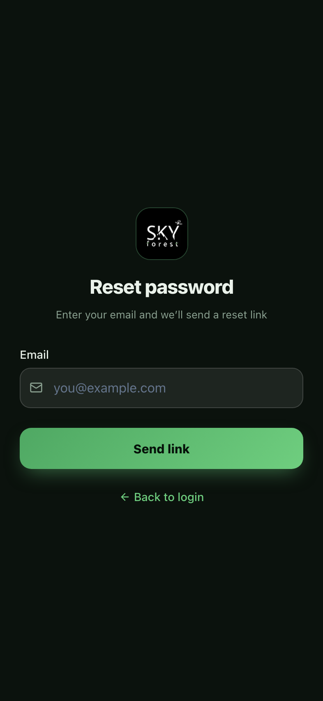

- **Маршрут:** `/forgot-password` · **файл:** `src/app/[locale]/(auth)/forgot-password/page.tsx`.
- **Элементы:** поле Email, кнопка отправки письма, состояние «письмо отправлено».
- **Данные:** `supabase.auth.resetPasswordForEmail`.

### 3.6 Новый пароль (по ссылке из письма)

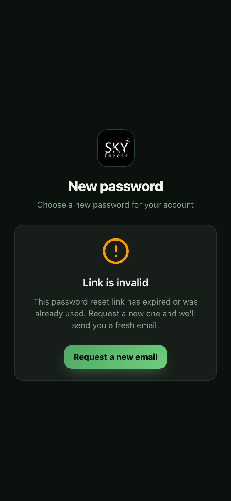

- **Маршрут:** `/reset-password` · **файл:** `src/app/[locale]/(auth)/reset-password/page.tsx`.
- **На скриншоте — состояние ошибки:** экран открыт без валидного recovery-токена,
  поэтому вместо формы показывается сообщение о недействительной/просроченной ссылке.
  Это **важное состояние для редизайна** (его легко забыть).

### 3.7 Определить гриб — стартовый экран

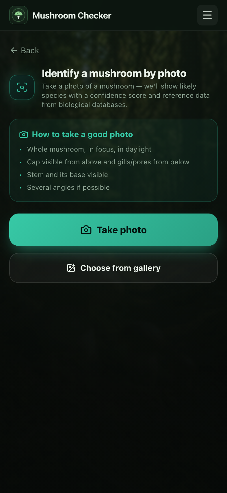

- **Маршрут:** `/dashboard/identify` (домашний экран флейвора).
- **Файл:** `src/app/[locale]/(app)/dashboard/identify/page.tsx` (клиентский компонент,
  ~520 строк — весь флоу распознавания в одном файле).
- **Оболочка:** `src/components/app/AppShell.tsx` + `src/components/app/AppHeader.tsx`.
  В нативе: статичный фон `public/images/app-bg-forest.png`, нет маркетингового футера,
  **нет таб-бара** (один экран), `<main>` с отступами под safe-area.
- **Элементы:**
  - шапка: иконка приложения, название **Mushroom Checker**, кнопка **☰** (меню);
  - ссылка **← Back** (`identify.back`) ведёт на `/dashboard`; в Checker
    middleware возвращает обратно на identify, поэтому на отдельном экране
    Checker (`src/components/checker/CheckerIdentify.tsx`) её нет;
  - заголовок с иконкой `ScanSearch` в «стеклянном» квадрате;
  - карточка **How to take a good photo** (`identify.tips` — 4 пункта);
  - **Take photo** (`btn-identify`, min-height 56px) — `capturePhoto()`;
  - **Choose from gallery** (min-height 52px) — `pickPhotoFromGallery()`.
- **Состояние ошибки:** красный блок над кнопками (`identify.errCapture` и коды ошибок API).
- **Данные:** `src/lib/capturePhoto.ts` — в нативе `@capacitor/camera`, в браузере
  скрытый `<input type="file" accept="image/*" capture>`; баланс — `useTokens()`
  (`src/lib/TokenContext.tsx`); стоимость — `TOKEN_COSTS.mushroom_identify` (1 токен).

### 3.8 Меню (☰) — вся навигация приложения

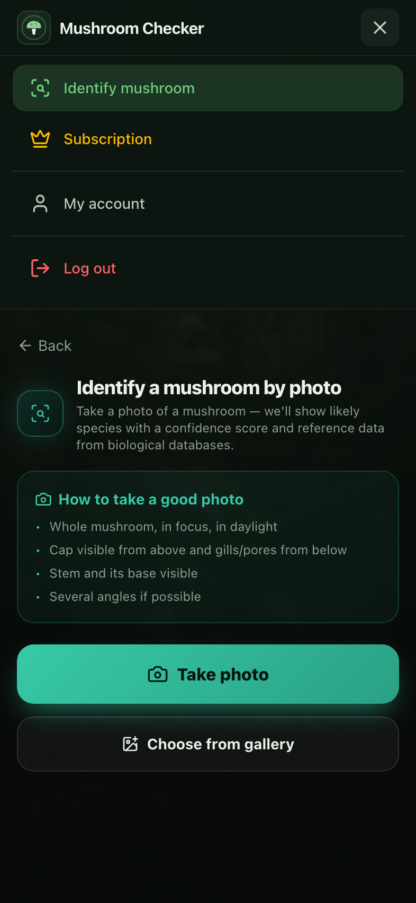

- **Файл:** `src/components/app/AppHeader.tsx` (панель `#app-mobile-nav`,
  раскрывается кнопкой с `aria-label={t("menu")}`).
- **Пункты во флейворе Checker:** **Identify mushroom** (активный, подсвечен),
  **Subscription** (иконка `Crown`, → `/payment`), **My account** (→ `/account`),
  **Log out** (красный, `supabase.auth.signOut()`).
- **Что скрыто по сравнению с SkyForest:** баланс токенов (`showTokens: false`),
  «Мои локации», «Лучшие дни», чаты маркетплейса, реферальная программа
  (в нативе запрещена Apple 3.1.1), «Грибные туры».
- **В вебе** к шапке добавляются переключатели **RU/EN** (`LocaleSwitcher`) и
  **°C/°F** (`UnitSwitcher`) — в нативной оболочке они скрыты.
- **Поведение:** затемняющий оверлей под панелью, закрытие по тапу вне,
  прокрутка панели с учётом safe-area (`max-h-[calc(100dvh-3.25rem)]`).
- ⚠️ **Находка:** это единственная навигация приложения, и она спрятана под ☰;
  при редизайне «Подписка» и «Аккаунт» стоит поднять на видимый уровень.

### 3.9 Фото выбрано — превью

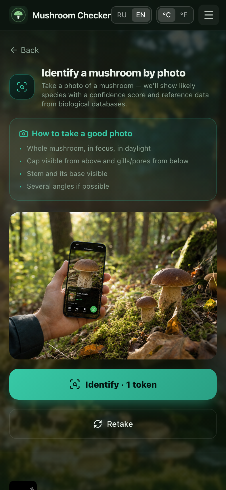

*Снято в браузерной раскладке (нужен реальный `<input type=file>`), поэтому видны
веб-шапка и переключатели RU/EN и °C/°F. Содержимое экрана в нативе идентично.*

- **Элементы:** превью 256px (`object-cover`), кнопка **Identify · 1 token**
  (`identify.identify` + `identify.costSuffix` — цена только в SkyForest),
  кнопка **Retake** (переснять).
- **Логика:** `setCaptured()` создаёт `URL.createObjectURL` и новый `requestId`
  (`crypto.randomUUID()`), который затем уходит в заголовке `Idempotency-Key`.

### 3.10 Модалка подтверждения списания (только SkyForest)

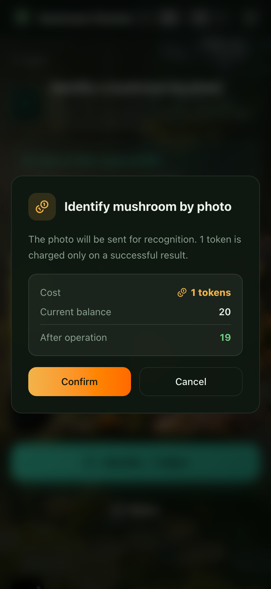

- **Файл:** `src/components/app/TokenConfirmModal.tsx`.
- **В Checker модалки нет:** тап по **Identify** сразу запускает распознавание,
  а исчерпанный лимит подписки объясняется сообщением
  `identify.errSubscriptionLimit`. Скриншот оставлен как описание модалки
  SkyForest.
- **Элементы:** заголовок `identify.confirmTitle`, описание `identify.confirmDesc`
  («токен списывается только при успешном результате»), строки **Cost** / **Current
  balance** / **After operation**, кнопки **Confirm** и **Cancel**.
- **Данные:** баланс из `useTokens()`.

### 3.11 Идёт распознавание

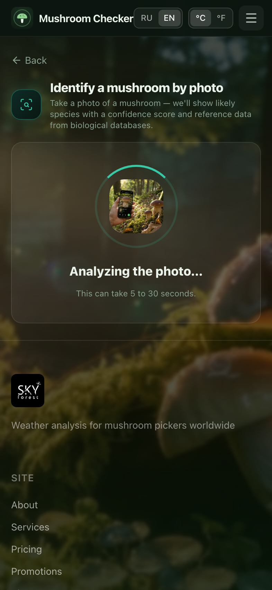

- **Элементы:** превью 78×78 внутри вращающегося кольца 120×120
  (`animate-spin`), заголовок `identify.analyzing`, подсказка `identify.analyzingHint`.
- **Данные:** `POST /api/mushrooms/identify` (multipart: `image`, `request_id`,
  `locale`; заголовок `Idempotency-Key`), таймаут клиента — 35 с (`AbortController`).

### 3.12 Результат распознавания

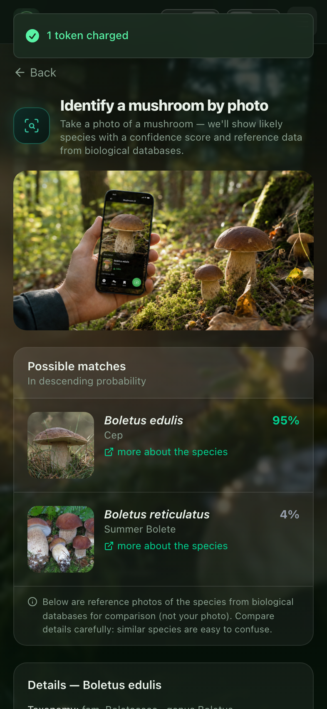
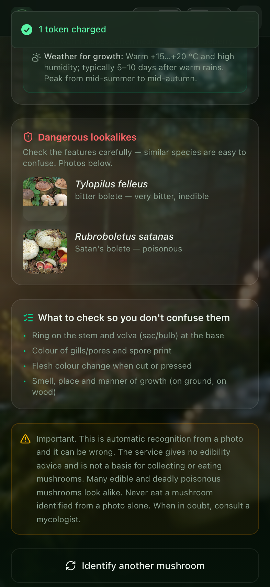

- **Блоки (сверху вниз):**
  1. фото пользователя (высота 192px);
  2. предупреждение о низкой уверенности (`result.low_confidence`, янтарная плашка);
  3. **Possible matches** — ранжированный список: референсное фото 80×80,
     латинское название курсивом, процент (зелёный ≥ 50 %, янтарный ≥ 30 %,
     серый ниже), народное название, пометка о токсичности с источником (GBIF),
     ссылка **Learn more** (Wikipedia/GBIF), сноска про референсные фото;
  4. **подробности вида** — таксономия (семейство, род), краткое описание,
     блок **Habitat** (зона + погода) — новые результаты приходят с `code`,
     текст подставляется на клиенте из `identify.habitatData`;
  5. **Dangerous lookalikes** — фото 64×64 + подпись, почему опасен;
  6. **чеклист** самопроверки (`identify.checklist`);
  7. дисклеймер (`identify.disclaimer`) — обязателен для App Review;
  8. кнопка **New photo** (`resetAll()`).
- **Состояния ошибок** (маппинг статусов в `mapError`): 402 — не хватает токенов,
  413 — файл слишком большой, 415 — неподдерживаемый формат, 422 — «не гриб»
  или «нет результата», 502/503 — сервис недоступен, `AbortError` — таймаут.
- **Данные:** ответ `IdentifyResponse` из `src/app/api/mushrooms/identify/route.ts`;
  успешное распознавание пишется в историю и списывает токен, затем `refreshTokens()`.

### 3.13 Пейволл подписки (в приложении)

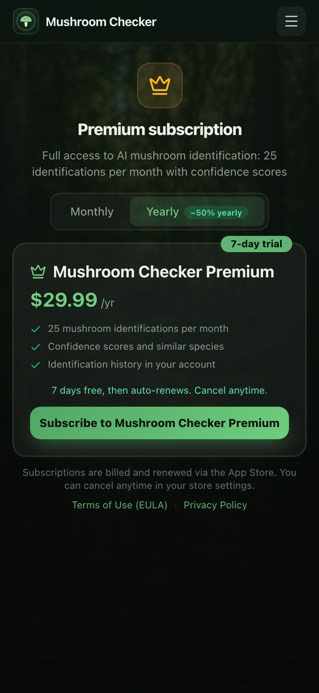
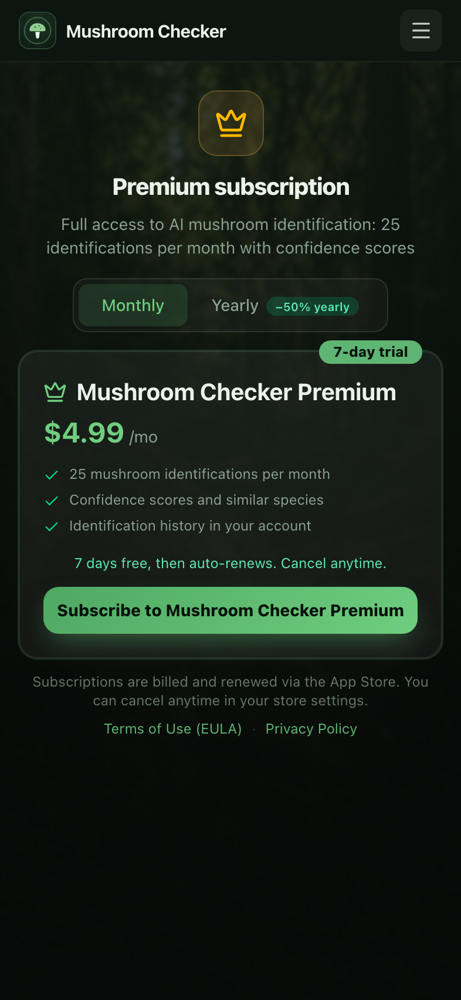

- **Маршрут:** `/payment` · **файл:** `src/app/[locale]/(app)/payment/page.tsx`
  (общий для всех флейворов; при `flavor !== "skyforest"` вся токеновая часть,
  вывод средств и реферальные баннеры скрыты — `isFlavored`).
- **Элементы:** иконка `Crown`, заголовок **Premium subscription**, подзаголовок;
  переключатель **Monthly / Yearly** (на годовом — бейдж `−50% yearly`);
  карточка тарифа с бейджем **7-day trial**, ценой из стора, тремя фичами
  (`checkerF1..F3`), строкой «7 days free, then auto-renews. Cancel anytime.»,
  кнопкой **Subscribe to Mushroom Checker Premium**; сноска про списание через
  App Store; обязательные ссылки **Terms of Use (EULA)** и **Privacy Policy**
  (требование App Review 3.1.2).
- **Данные:** каталог продуктов — `src/lib/native/iapProducts.ts`
  (`subscriptionProductsForBundle("ai.skyforest.mushroomchecker")`); реальные цены —
  `getSubscriptionPrices()` / `subscribeSubscriptionPrices()` из `src/lib/native/iap.ts`
  (RevenueCat/StoreKit); статус текущей подписки — `GET /api/subscription`.
- **Состояние «подписка активна»:** вместо тарифов — зелёная карточка с датой
  окончания и кнопкой **Manage subscription** (`manageSubscriptions()` открывает
  настройки подписок стора); при `status === "canceled"` — янтарная приписка.

### 3.14 Пейволл в браузере

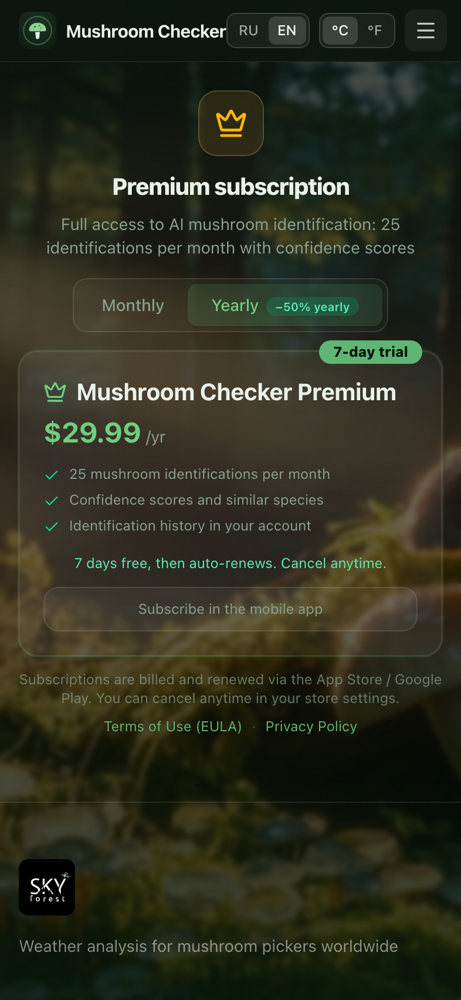

- Тот же маршрут `/payment`, но **без нативной оболочки**: кнопка покупки
  заменена на текст `subscription.webNote` — «оформить можно только в приложении».
  Так сделано, чтобы не проводить платежи за подписку мимо сторов.

### 3.15 Аккаунт

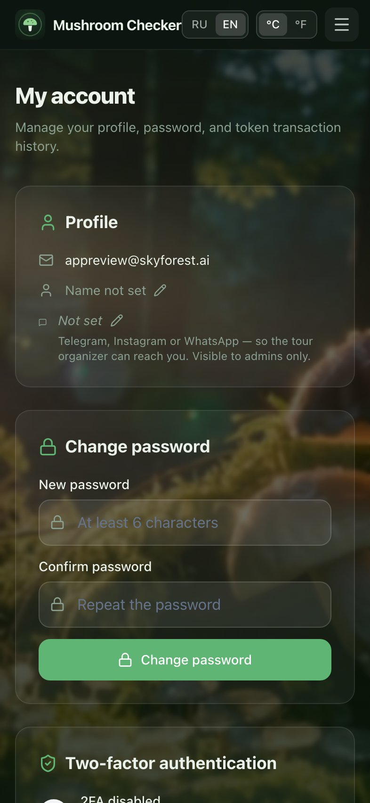

*Снято в браузерной раскладке — см. раздел «Что не удалось снять».*

- **Маршрут:** `/account` · **файл:** `src/app/[locale]/(app)/account/page.tsx`
  (серверный компонент, тянет данные и раскладывает клиентские карточки).
- **Карточки и их файлы:**
  - **Profile** — email и имя (`src/components/app/EditProfileName.tsx`);
    контактная ссылка (`EditContactLink.tsx`) — только в SkyForest, она нужна
    организаторам туров;
  - **Subscription** — статус и переход на `/payment`, только во флейворах;
  - **Change password** — `src/components/app/ChangePassword.tsx`
    (поля «новый пароль» ≥ 6 символов и подтверждение);
  - **Two-factor authentication** — `src/components/app/TwoFactorSetup.tsx`
    (включение TOTP, QR, резервные коды);
  - **App Lock** — `src/components/native/BiometricLockSetting.tsx`, рендерится
    **только в нативе и только если есть биометрия** (Face ID / отпечаток),
    настройка хранится в Capacitor Preferences (`biometric_lock_enabled`);
  - **Legal** — оферта, политика, удаление аккаунта; во флейворах и только в
    нативе (в вебе те же ссылки есть в футере);
  - **Delete account** — `src/components/app/DeleteAccount.tsx`: модалка с вводом
    email для подтверждения, удаление с 14-дневным периодом отмены;
  - **баланс и история токенов**, `MushroomBotCard` — только в SkyForest.
- **Данные:** Supabase — `profiles`; баланс и транзакции запрашиваются только в
  SkyForest; без сессии — `redirect("/login")`.
- **История:** до v1.41.0 экран целиком повторял SkyForest — с балансом токенов,
  историей транзакций и подзаголовком про «token transaction history».

### 3.16 Оферта / EULA и Политика конфиденциальности

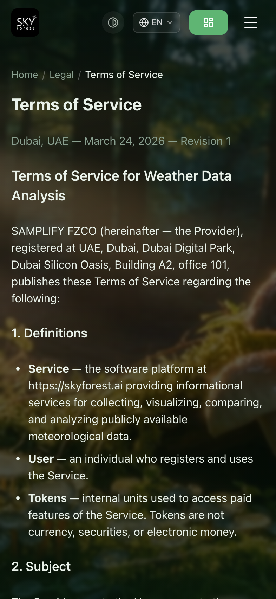
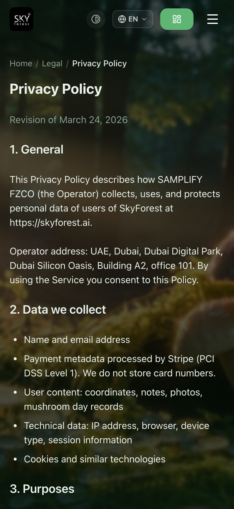

- **Маршруты:** `/offer`, `/privacy` · **файлы:**
  `src/app/[locale]/(marketing)/offer/page.tsx`, `.../privacy/page.tsx`.
- Длинные юридические тексты в `prose`-разметке. Открываются из пейволла
  (обязательное требование App Review) и из меню. Внутри нативной оболочки
  показываются в том же WebView.
- **Во флейворах** документы подставляют название и адрес приложения, предмет и
  модель оплаты (подписка вместо токенов) и свой дисклеймер; вместо
  маркетингового header/footer SkyForest — компактная оболочка
  `src/components/marketing/FlavorLegalShell.tsx` со ссылками на документы.

### 3.17 Удаление аккаунта (публичная страница)

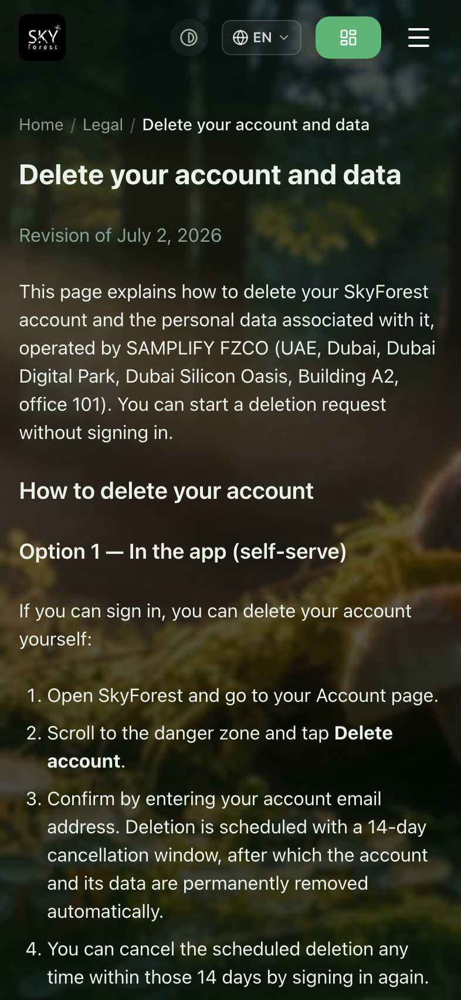

- **Маршрут:** `/delete-account` · **файл:**
  `src/app/[locale]/(marketing)/delete-account/page.tsx`.
- **Назначение:** требование сторов — инструкция по удалению аккаунта, доступная
  **без входа**. Описывает способ 1 (в приложении, 14 дней на отмену) и способ 2
  (письмо в поддержку, 30 дней), перечисляет, что удаляется и что хранится.

### 3.18 Чужой маршрут → редирект


- Открыт `/dashboard/weather` (экран SkyForest). Middleware по `allowedPaths`
  редиректит на `/dashboard/identify` — пользователь видит домашний экран.
  Отдельной страницы 404/«недоступно» нет.

---

## 4. Сквозные флоу (пошагово)

### 4.1 Регистрация и вход (email / Google / Apple)

1. Холодный старт → нативный splash + `NativeSplash` (≈1.8 с).
2. `NativeAppProvider` проверяет сессию: нет → `/login`.
3. **Continue with Google / Continue with Apple** → `supabase.auth.signInWithOAuth`,
   в нативе — системный браузер/ASWebAuthenticationSession, возврат по deep link на
   `/auth/callback` (`src/app/auth/callback/route.ts`), затем на домашний экран.
4. Либо **Create account** → `/register` → email + пароль → письмо-подтверждение →
   `/login`.
5. `signInWithPassword` → `mfa.listFactors()`; при подтверждённом TOTP →
   `/verify-mfa` (`src/app/[locale]/(auth)/verify-mfa/page.tsx`) → 6 цифр →
   `mfa.challengeAndVerify` → домашний экран.
6. Сессия в cookie, `middleware` обновляет её на каждом запросе.

### 4.2 Распознавание гриба (фото → списание → результат)

1. `/dashboard/identify` → **Take photo** (камера) или **Choose from gallery**.
2. `capturePhoto()`: в нативе `Camera.getPhoto({ resultType: base64 })`; отмена
   пользователем → `null` (тихо), ошибка доступа → тост `identify.errCapture`.
3. Файл в состоянии, превью через `URL.createObjectURL`, генерируется `requestId`.
4. **Identify · 1 token** → `TokenConfirmModal` (стоимость, баланс, остаток).
5. **Confirm** → `POST /api/mushrooms/identify` с `Idempotency-Key`; экран
   «Analyzing…»; таймаут 35 с.
6. Успех: токен списан (`toastCharged`), `refreshTokens()`, показан результат.
   Ошибка: токен **не** списывается, экран возвращается к превью с красной плашкой.
7. **New photo** сбрасывает состояние (`revokeObjectURL`).
8. Лимит подписки (25 распознаваний в месяц) проверяется на сервере; при
   исчерпании — 402 и текст `identify.errInsufficient`.

### 4.3 Оформление подписки с 7-дневным триалом

**В приложении (единственный способ купить):**

1. Меню **☰** → **Subscription** (или переход на `/payment`).
2. `initIap()` поднимает StoreKit/Play Billing, подтягивает локальные цены.
3. Выбор **Monthly / Yearly** (год со скидкой −50 %).
4. **Subscribe to Mushroom Checker Premium** → системный диалог стора;
   первые 7 дней бесплатно, далее автопродление.
5. Успешная покупка → чек уходит на бэкенд, `GET /api/subscription` начинает
   отдавать активную подписку → карточка меняется на **Subscription active until …**.
6. Управление/отмена — только через настройки стора (**Manage subscription**).

**В браузере:** тот же экран показывает состав тарифа и ссылки на EULA/политику,
но вместо кнопки — пояснение, что оформление доступно в мобильном приложении.

### 4.4 Удаление аккаунта

1. `/account` → карточка **Delete account** → **Удалить аккаунт**.
2. Модалка (`DeleteAccount.tsx`): предупреждение + поле для ввода email аккаунта.
3. Подтверждение → удаление планируется, даётся **14 дней на отмену** (достаточно
   снова войти в аккаунт).
4. По истечении срока аккаунт и данные удаляются безвозвратно.
5. Альтернатива без входа — `/delete-account`: письмо на адрес поддержки,
   обработка до 30 дней.

---

## 5. Что важно сохранить при редизайне

- **Флейвор определяется хостом, а не сборкой.** Любой новый экран должен быть
  добавлен в `FLAVORS.checker.allowedPaths`, иначе middleware отправит на
  `/dashboard/identify`. Один Next-инстанс обслуживает три домена.
- **Ветка `isNative` есть в разметке экранов.** `/login` содержит две независимые
  вёрстки, `AppShell` меняет фон (видео → статичное фото), футер и отступы,
  `NativeTabBar` скрывается при одном разделе. Редизайн нужно проверять в обоих режимах.
- **Таб-бара в Checker нет специально** (`navHrefs` из одного элемента). Если появится
  второй раздел, таб-бар включится сам — это изменит нижние отступы `<main>`.
- **Safe-area и тач-таргеты.** `pt-[env(safe-area-inset-top)]`,
  `pb-[calc(4.75rem+env(safe-area-inset-bottom))]`, кнопки 52–56 px по высоте,
  таб-иконки `min-h-[44px]`. Уменьшать нельзя — это требования HIG/App Review.
- **Тёмная тема и брендовые цвета.** `colorScheme: dark` по умолчанию; акцент
  Checker — `identify` / `identify-dark` (бирюзовый `#37c9a6`), у SkyForest —
  зелёный `primary`. Переменные и классы `.glass`, `.btn-identify`, `.btn-primary`
  живут в `src/app/globals.css`.
- **`backdrop-filter` в `.glass` — тяжёлый.** На мобильных WebView это заметная
  нагрузка (и причина того, что headless Chromium не отдаёт кадр на `/account`).
  Стоит уменьшить число слоёв блюра, а не добавлять новые.
- **Обязательные для App Review элементы:** дисклеймер на экране результата,
  ссылки **Terms of Use (EULA)** и **Privacy Policy** прямо в покупке, текст про
  автопродление и отмену, доступная без входа страница `/delete-account`.
  Никаких промокодов/реферальных бонусов в нативе (Apple 3.1.1) —
  реферальные блоки уже скрыты через `!native && !isFlavored`.
- **i18n только через `next-intl`.** Никаких строк в разметке: `useTranslations`
  на клиенте, `getTranslations` на сервере, словари — `src/i18n/messages/*.{ru,en}.ts`.
  Локали `ru`/`en`, `localePrefix: "as-needed"`, на `.ai` дефолт — английский.
- **Идемпотентность распознавания** (`requestId` + `Idempotency-Key`) и правило
  «токен списывается только при успехе» — поведение, которое нельзя потерять
  при переработке экрана.

### Что стоит исправить (найдено при съёмке)

Пункты 1, 3 и 4 закрыты в v1.41.0 — оставлено как история находок:

1. ~~Splash показывает логотип SkyForest вместо иконки Mushroom Checker.~~
   Splash, экраны входа/регистрации/восстановления и экран блокировки берут
   иконку, название и таглайн из флейвора (`useFlavorBrand`, `AuthBrandMark`).
2. Ссылка **← Back** на домашнем экране ведёт в никуда — закрывается вместе с
   отдельным экраном Checker (`src/components/checker/CheckerIdentify.tsx`):
   на одноэкранном приложении ссылки «назад» нет.
3. ~~`/account` говорит про токены.~~ На `/account` вместо баланса и истории
   токенов — карточка подписки; исчерпанный лимит объясняется сообщением
   `identify.errSubscriptionLimit` вместо модалки списания.
4. ~~На `/account` тяжёлые для одноэкранного приложения блоки.~~ Скрыты баланс
   и история транзакций, бот, контакт для организаторов туров; добавлены
   подписка и юридические ссылки (в нативной оболочке, где нет футера).

---

## 6. Файлы, которые придётся править при редизайне

**Экраны (страницы):**

- `src/app/[locale]/(app)/dashboard/identify/page.tsx` — весь флоу распознавания
- `src/app/[locale]/(app)/payment/page.tsx` — пейволл подписки (общий с WayBack)
- `src/app/[locale]/(app)/account/page.tsx` — аккаунт
- `src/app/[locale]/(auth)/login/page.tsx` · `register` · `forgot-password` ·
  `reset-password` · `verify-mfa`
- `src/app/[locale]/landing/checker/page.tsx` — посадочная
- `src/app/[locale]/(marketing)/offer/page.tsx` · `privacy` · `delete-account`

**Оболочка и навигация:**

- `src/components/app/AppShell.tsx` — фон, `<main>`, футер/таб-бар
- `src/components/app/AppHeader.tsx` — шапка, меню ☰, переключатели языка/единиц
- `src/components/native/NativeTabBar.tsx` — таб-бар (в Checker скрыт)
- `src/components/native/NativeSplash.tsx` — splash
- `src/components/native/UpdatePrompt.tsx` — предложение обновиться
- `src/components/native/NativeOnly.tsx` — обёртки `NativeOnly` / `WebOnly`
- `src/components/marketing/Footer.tsx` — веб-футер

**Компоненты экранов:**

- `src/components/app/TokenConfirmModal.tsx` — подтверждение списания
- `src/components/app/ChangePassword.tsx`, `TwoFactorSetup.tsx`,
  `EditProfileName.tsx`, `EditContactLink.tsx`, `TransactionHistory.tsx`,
  `DeleteAccount.tsx`, `MushroomBotCard.tsx`
- `src/components/native/BiometricLockSetting.tsx`
- `src/components/auth/SocialLoginButtons.tsx`

**Стили:**

- `src/app/globals.css` — **единственный** источник темы: Tailwind v4, блок
  `@theme inline` (`--color-primary: #5fb573`, `--color-identify: #37c9a6`, …),
  классы `.glass` / `.glass-strong`, `.btn-primary`, `.btn-identify`,
  анимации `sf-float` / `sf-pulse-dot`, тема высокой контрастности
  (`html[data-theme="hc"]`). Отдельного `tailwind.config.ts` в проекте нет.

**Флейвор, маршруты, оплата:**

- `src/lib/appFlavor.ts` — `allowedPaths`, `navHrefs`, `homePath`, `showTokens`
- `src/lib/useAppFlavor.ts` — флейвор на клиенте
- `src/middleware.ts` — rewrite `/`, редиректы, защита маршрутов
- `src/lib/native/iapProducts.ts`, `src/lib/native/iap.ts` — продукты и покупки
- `src/lib/tokens.ts` — стоимость операций
- `src/lib/capturePhoto.ts` — камера/галерея
- `src/lib/TokenContext.tsx` — баланс

**i18n:**

- `src/i18n/messages/identify.{ru,en}.ts`, `payment.*`, `subscription.*`,
  `auth.*`, `account.*`, `appHeader.*`, `common.*`
- `src/i18n/routing.ts`, `src/i18n/brand-locale.ts`, `src/i18n/navigation.ts`

**PWA / иконки:**

- `public/manifest-checker.webmanifest`, `public/icons/checker-*.png`
  (в том числе `checker-512.png` — splash и экраны входа),
  `public/images/app-bg-forest.png` (фон)

> Нативные проекты (`apps/`, `ios/`, `android/`, `fastlane/`) в этой задаче не
> трогались: UI живёт в вебе, оболочка лишь открывает боевой сайт в WebView.

---

## 7. Как перезаснять скриншоты

```bash
cd skyforest
node scripts/capture-ui-flows.mjs checker            # без реального распознавания
node scripts/capture-ui-flows.mjs identify-result    # +анализ и результат (спишет 1 токен)
```

Учётные данные демо-аккаунта переопределяются через `UI_FLOWS_EMAIL` / `UI_FLOWS_PASSWORD`,
хост — через `UI_FLOWS_CHECKER`. Реестр снятых экранов — `docs/ui-flows/manifest.json`.

Проверить, что во флейворах не осталось «чужих» сущностей, можно на локальной
прод-сборке: `npm start`, затем `node scripts/verify-flavor-cleanup.mjs` — скрипт
подменяет хосты через host-resolver Chromium, логинится демо-аккаунтом и ищет на
экранах упоминания SkyForest, токенов, рефералки и функций, которых в приложении
нет.

### Что не удалось снять и почему

- **`/account` в нативной раскладке.** В симуляции нативной оболочки (Capacitor-мок
  в обычном Chromium) рендерер этой страницы после гидрации перестаёт отдавать кадры:
  зависают и `page.screenshot`, и CDP `Page.captureScreenshot`, и любой `evaluate`
  (проверено также в headed-режиме, с GPU-флагами, с отключёнными анимациями и
  `backdrop-filter`, без WebAuthn). В web-режиме та же страница снимается за ~250 мс,
  поэтому скриншот сделан в браузерной раскладке — содержимое карточек идентично,
  отличается только оболочка (веб-шапка и футер вместо нативных отступов).
  На реальном устройстве экран работает нормально.
- **Экраны, требующие реального устройства:** системный диалог покупки App Store,
  диалог Face ID для **App Lock**, экран `UpdatePrompt` (нужен новый билд в сторе),
  OAuth-экраны Google/Apple (внешние страницы провайдеров).
- **`/verify-mfa`** — у демо-аккаунта не включён TOTP, поэтому экран недостижим
  без изменения настроек аккаунта.
