# WayBack — все экраны и флоу (основа для редизайна)

Скриншоты: `docs/ui-flows/wayback/` · снято скриптом `scripts/capture-ui-flows.mjs`
(Playwright, iPhone 14 Pro 393×852 @2x, тёмная тема, симуляция нативной оболочки iOS,
геолокация подменена на загородную точку под Минском 53.9412 / 27.3168, боевой хост
`https://wayback.skyforest.ai`; офлайн-оболочка — с локального статик-сервера).

> **Язык на скриншотах приложения — английский.** На домене `*.skyforest.ai`
> `defaultLocale` = `en` (`src/i18n/brand-locale.ts`) и `localePrefix: "as-needed"`,
> поэтому без префикса `/ru` отдаётся английская версия. Русская — те же экраны
> по `/ru/...`. **Офлайн-экран нативной оболочки** имеет собственный мини-i18n и
> на скриншотах показан по-русски.

---

## 1. Что это за приложение

**WayBack** — «не потеряться в походе»: приложение запоминает точку входа и
всегда показывает стрелку и расстояние до неё. Всё построено вокруг работы
**без интернета**: карта скачивается заранее, а стрелка и расстояние считаются
на устройстве и работают всегда.

- **Аудитория:** грибники, ягодники, любители прогулок и походов — люди без
  туристических навигаторов, у которых за городом пропадает сеть.
- **Цель продукта:** подписка **WayBack Premium** (7-дневный триал), покупка
  только через App Store / Google Play.
- **Главная особенность:** трек работает **без регистрации** — единственный
  флейвор с `anonymousPaths`. История и активный поход живут на устройстве
  (localStorage + Capacitor Preferences), Supabase — только для синхронизации.
- **Технически** это флейвор SkyForest: тот же Next.js-инстанс, флейвор
  определяется хостом (`src/lib/appFlavor.ts`). Нативный `appId` —
  `ai.skyforest.wayback`.

### Ключевые ограничения флейвора (`FLAVORS.wayback`)

| Параметр | Значение |
| --- | --- |
| `homePath` | `/dashboard/track` |
| `allowedPaths` | `/login`, `/register`, `/forgot-password`, `/reset-password`, `/verify-mfa`, `/account`, `/privacy`, `/delete-account`, `/landing`, `/dashboard/track`, `/payment`, `/offer` |
| `anonymousPaths` | **`/dashboard/track`** — трек доступен без входа |
| `navHrefs` | `["/dashboard/track"]` → нижний таб-бар не рендерится |
| `showTokens` | `false` |
| манифест / иконка | `/manifest-wayback.webmanifest`, `/icons/wayback-192.png` |

---

## 2. Карта экранов

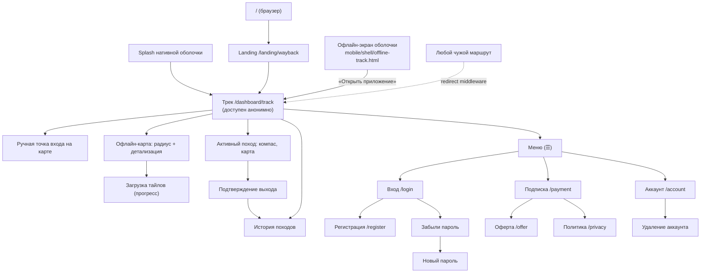
```mermaid
flowchart TD
    Splash["Splash нативной оболочки"] --> Track
    Root["/ (браузер)"] --> Landing["Landing /landing/wayback"]
    Landing --> Track

    OfflineShell["Офлайн-экран оболочки<br/>mobile/shell/offline-track.html"] -->|«Открыть приложение»| Track

    Track["Трек /dashboard/track<br/>(доступен анонимно)"] --> Pick["Ручная точка входа на карте"]
    Track --> OfflineRegion["Офлайн-карта: радиус + детализация"]
    OfflineRegion --> Downloading["Загрузка тайлов (прогресс)"]
    Track --> Active["Активный поход: компас, карта"]
    Active --> FinishConfirm["Подтверждение выхода"]
    FinishConfirm --> History["История походов"]
    Track --> History

    Track --> Menu["Меню (☰)"]
    Menu --> Paywall["Подписка /payment"]
    Menu --> Login["Вход /login"]
    Menu --> Account["Аккаунт /account"]

    Login --> Register["Регистрация /register"]
    Login --> Forgot["Забыли пароль"]
    Forgot --> Reset["Новый пароль"]
    Paywall --> Offer["Оферта /offer"]
    Paywall --> Privacy["Политика /privacy"]
    Account --> Delete["Удаление аккаунта"]

    Blocked["Любой чужой маршрут"] -.->|redirect middleware| Track
```

Переходы на уровне `src/middleware.ts`:

- `/` → **rewrite** на `/{locale}/landing/wayback`;
- путь вне `allowedPaths` → **redirect** на `/dashboard/track`;
- `/dashboard/track` **не требует** сессии (`anonymousPaths`);
- `/payment`, `/account` без сессии → `/login?redirect=...`;
- `/login` при активной сессии → `/dashboard/track`.

---

## 3. Экраны

### 3.1 Splash нативной оболочки

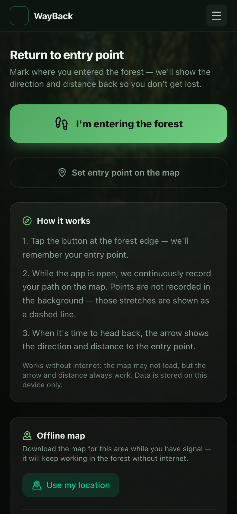

- **Файл:** `src/components/native/NativeSplash.tsx` + нативный splash Capacitor.
- **Элементы:** иконка-компас `public/icons/wayback-512.png`, название **WayBack**,
  таглайн `flavor.wayback.tagline`, три пульсирующие точки; фон — радиальный
  градиент `#0e1710`.
- **Тайминги:** 1300 мс показа + 500 мс затухания, страховка 3000 мс.
- **История:** до v1.41.0 здесь был логотип SkyForest.

### 3.2 Посадочная страница (только браузер)

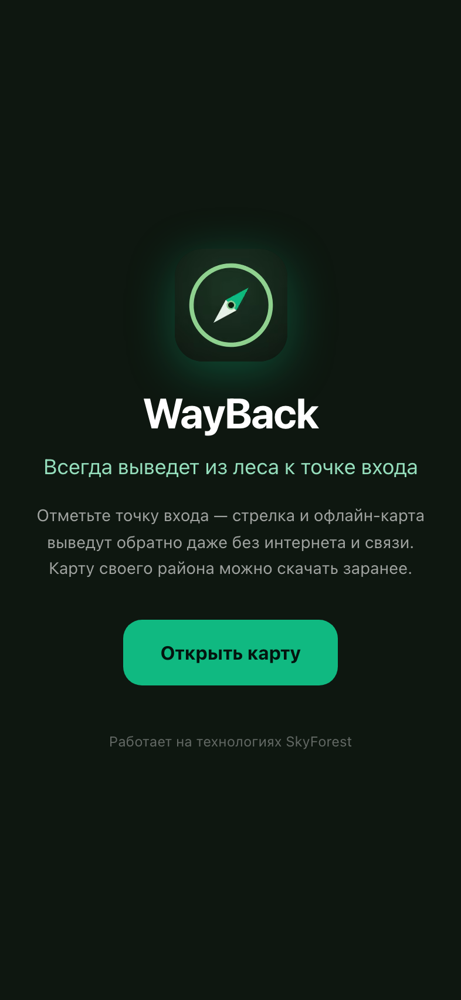

- **Маршрут:** `/` (rewrite на `/{locale}/landing/wayback`).
- **Файл:** `src/app/[locale]/landing/wayback/page.tsx`.
- **Назначение:** объяснить идею («отметил вход — вернулся по стрелке») и увести
  в приложение/на трек. В нативной оболочке недостижима.

### 3.3 Вход

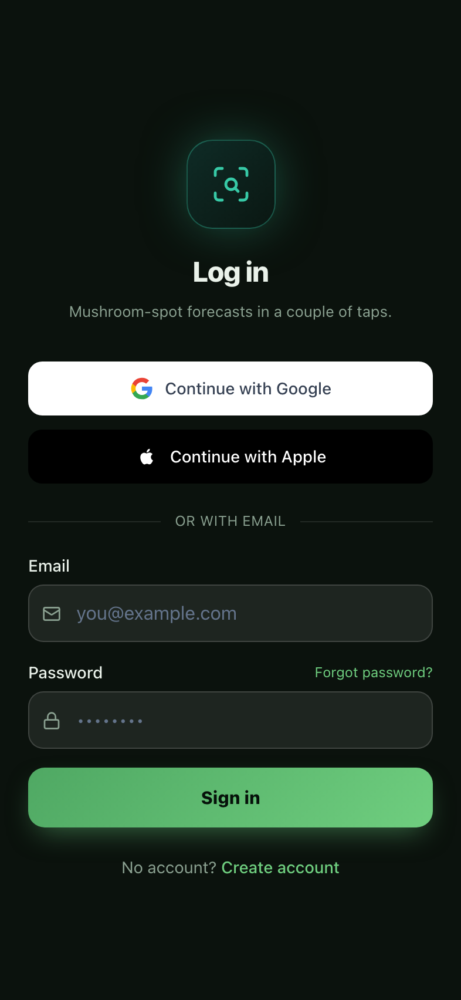

- **Маршрут:** `/login` · **файл:** `src/app/[locale]/(auth)/login/page.tsx`
  (нативная и веб-вёрстки в одном файле, ветка `if (isNative)`).
- **Элементы:** иконка-компас WayBack и подзаголовок `flavor.wayback.authSubtitle`
  (`src/components/auth/AuthBrandMark.tsx`), **Continue with Google** /
  **Continue with Apple** (`src/components/auth/SocialLoginButtons.tsx`),
  разделитель `OR WITH EMAIL`, поля Email / Password, **Forgot password?**,
  кнопка **Sign in**, ссылка **Create account**.
- **Данные:** `supabase.auth.signInWithPassword` → `mfa.listFactors()`.
- **Особенность WayBack:** вход **не обязателен** для основной функции. Он нужен
  только для подписки, синхронизации истории между устройствами и `/account`.
- **История:** до v1.41.0 экран показывал иконку и слоган SkyForest
  (`auth.nativeSlogan` про грибные прогнозы).

### 3.4 Регистрация · 3.5 Восстановление пароля · 3.6 Новый пароль

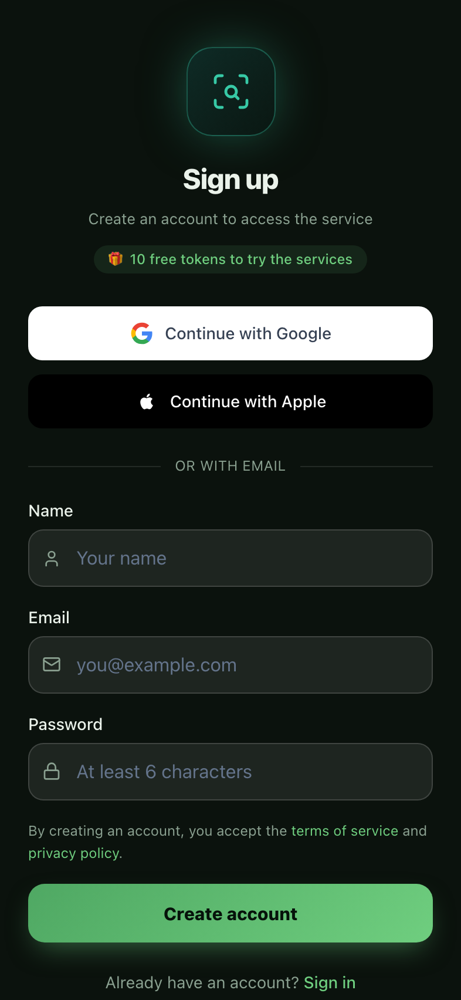


- **Маршруты:** `/register`, `/forgot-password`, `/reset-password`
  (`src/app/[locale]/(auth)/…`).
- Экран `reset-password` снят **в состоянии ошибки** — открыт без валидного
  recovery-токена, поэтому вместо формы показано сообщение о недействительной
  ссылке. Состояние легко упустить при редизайне.

### 3.7 Трек без входа (анонимный режим)


- **Маршрут:** `/dashboard/track` без сессии — работает благодаря
  `anonymousPaths: ["/dashboard/track"]`.
- **Назначение:** дать основную ценность сразу, без регистрации. Данные похода
  пишутся только на устройство (`localStorage` + Preferences).
- **Отличие от авторизованного вида:** в шапке нет меню аккаунта/подписки —
  соответственно, из этого состояния нельзя ни купить подписку, ни попасть в
  историю на другом устройстве.

### 3.8 Трек — похода нет (главный экран)


- **Маршрут:** `/dashboard/track` (домашний экран флейвора).
- **Файл:** `src/app/[locale]/(app)/dashboard/track/page.tsx`.
- **Оболочка:** `src/components/app/AppShell.tsx` + `AppHeader.tsx`; в нативе —
  статичный фон `public/images/app-bg-forest.png`, без веб-футера, **без таб-бара**.
- **Элементы:**
  - заголовок **Return to entry point** + подзаголовок (`track.title/subtitle`);
  - главная кнопка **I'm heading outdoors** (`btn-primary`, иконка `Footprints`,
    высота ~72 px) — ставит якорь по GPS; при нажатии показывает **Starting…** со спиннером;
  - вторичная кнопка **Set entry point on the map** — ручной выбор точки
    (`src/components/app/StartPointPicker.tsx`);
  - карточка **How it works** — три шага (`track.how1..how3`) + приписка
    `track.offlineHint` («работает без интернета… данные только на этом устройстве»);
  - блок **Offline map** — `src/components/app/OfflineMapManager.tsx` (см. 3.10);
  - блок **History** — `src/components/app/TrackHistory.tsx`, **рендерится только
    если есть сохранённые походы** (иначе `return null`).
- **Данные:** активный поход — `loadTrack()` из `src/lib/trackState.ts`
  (`localStorage["sf_active_track"]`); при пустом localStorage — попытка поднять
  поход из Capacitor Preferences (`hydrateTrackFromNative()`), чтобы не потерять
  якорь, поставленный в офлайн-экране оболочки.
- **Состояние загрузки:** до `mounted` — только спиннер (данные из localStorage
  нельзя читать на сервере).

### 3.9 Ручной выбор точки входа на карте

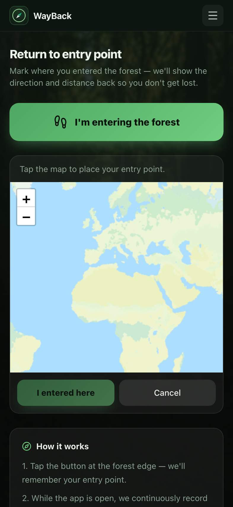

- **Файл:** `src/components/app/StartPointPicker.tsx` (грузится через
  `next/dynamic`, `ssr: false`).
- **Когда появляется:** по кнопке **Set entry point on the map** или автоматически,
  если GPS не дал фикс (`handleStart` → `toast.error(track.geoErrorPick)` → `picking = true`).
- **Элементы:** подсказка **Tap the map to place your entry point.**, карта Leaflet
  с зумом ±, кнопки **I entered here** (подтвердить) и **Cancel**.
- **Центр карты (с v1.41.0):** текущая позиция → последняя известная позиция
  устройства (`src/lib/lastKnownPosition.ts`, пишется при каждом успешном
  геозапросе и точке трека) → якорь активного похода → центр скачанного
  офлайн-региона → обзорный вид сервиса. На скриншоте — прежнее поведение
  (карта мира), которое и было находкой.
- **Данные:** тайлы — тот же `OfflineTileLayer` (офлайн-кеш + сеть).

### 3.10 Офлайн-карта: выбор региона

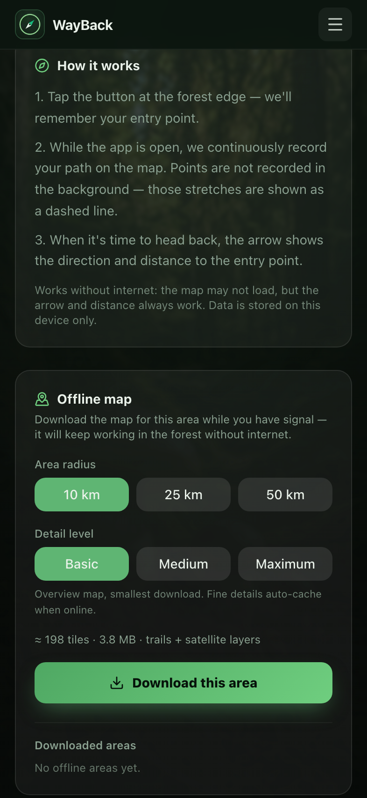

- **Файл:** `src/components/app/OfflineMapManager.tsx`.
- **Элементы:**
  - заголовок **Offline map** + пояснение (`track.offlineMapTitle/Desc`);
  - до определения центра — кнопка **Use my location** (спиннер → `Getting location…`);
  - **Area radius** — 10 / 25 / 50 км (`RADIUS_OPTIONS`);
  - **Detail level** — **Basic** (z≤13) / **Medium** (z≤15) / **Maximum** (z≤16)
    + подсказка выбранного уровня; число тайлов растёт ~×4 на каждый зум;
  - честная оценка **≈ 198 tiles · 3.8 MB · trails + satellite layers** —
    считается до загрузки (`countTilesForBbox`, средний вес тайла 14 КБ для троп
    и 25 КБ для спутника);
  - кнопка **Download this area**;
  - раздел **Downloaded areas** — пустое состояние **No offline areas yet.**,
    иначе список: название (радиус · уровень · дата), число тайлов, размер,
    диапазон зумов, тап — предпросмотр региона на карте
    (`src/components/app/RegionPreview.tsx`), корзина — удаление.
- **Данные:** `src/lib/offline/tileStore.ts` — два источника
  (`OUTDOOR_SOURCE` — тропы, `SATELLITE_SOURCE` — спутник Esri), тайлы в
  Capacitor Filesystem (`directory: "DATA"`), метаданные регионов — там же.

### 3.11 Загрузка тайлов региона

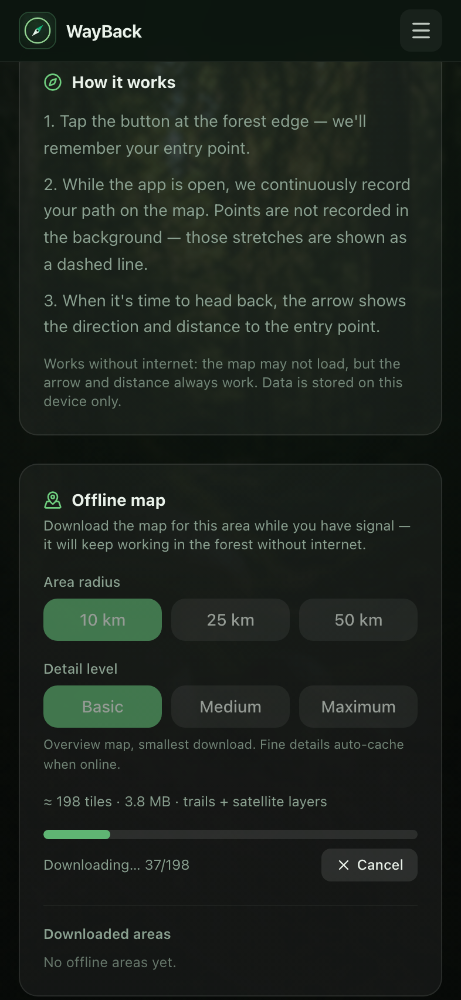

- **Элементы:** полоса прогресса, строка **Downloading… 46/198**, кнопка **Cancel**
  (`AbortController`); кнопка скачивания на время загрузки заменяется прогрессом,
  переключатели радиуса/детализации блокируются.
- **Итоги:** тост об успехе, о частичной загрузке (`offlineMapPartialToast`
  с числом неудачных тайлов) или об ошибке; список скачанных участков обновляется.

### 3.12 Активный поход

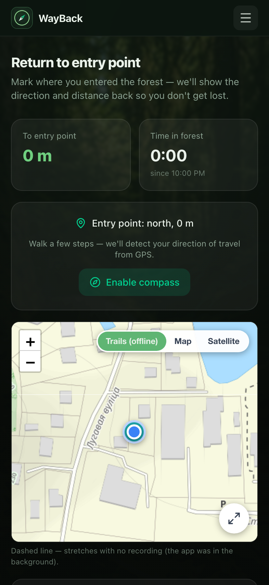
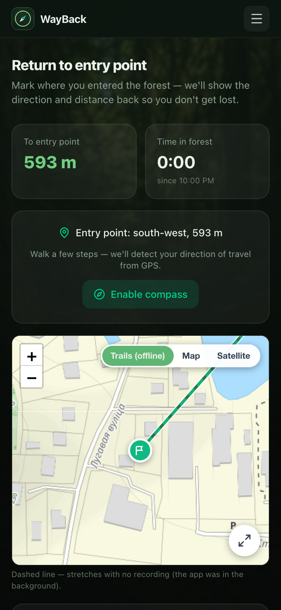

- **Элементы (сверху вниз):**
  - две плитки: **To entry point** (расстояние, крупным акцентным цветом) и
    **On the walk** (`H:MM` + строка `since 22:00`);
  - **компас возврата** — круг 144 px с треугольной стрелкой
    (`ReturnArrow`, наконечник строго вверх, поворот CSS-transform);
  - подпись **Entry point: north, 0 m** (`track.directionText`) и пояснение,
    по какому источнику считается направление;
  - если направление ещё не определено — текст **Walk a few steps…** и кнопка
    **Enable compass** (на iOS запрашивает доступ к датчикам ориентации из жеста
    пользователя; если 5 с нет показаний — `compassUnavailable`);
  - карта `src/components/app/TrackMap.tsx` с переключателем слоёв
    **Trails (offline) / Map / Satellite**, зумом ±, кнопкой раскрытия на весь экран,
    синей точкой «я здесь», якорем и линией пути;
  - легенда: **dashed — stretches with no recording** (причину не называем:
    в сборках без фоновой записи это фон, в 1.1 и новее — отсутствие спутников);
  - блок **Offline map** (тот же менеджер, центр — якорь похода);
  - кнопка **I'm back from outdoors** (красная, вторичная).
- **Логика направления:** приоритет у **курса движения по GPS**
  (`courseOverGround` по буферу последних позиций) — он в одной системе отсчёта
  с азимутом на якорь; магнитометр (`deviceorientation` / `webkitCompassHeading`)
  — запасной вариант для стоящего человека; если оба недоступны — только текст
  со стороной света и пунктир на карте.
- **Данные:** точки пишет глобальный `TrackRecorder` (`src/lib/trackRecorder.ts`),
  в WayBack — через обёртку `WayBackTrackRecorder` из `wb/layout.tsx`, которая
  отдаёт ему текст постоянного уведомления. Запись непрерывна и **продолжается со
  свёрнутым приложением и погашенным экраном**
  (`src/lib/track/backgroundWatch.ts`: на Android служба переднего плана с
  уведомлением, на iOS `UIBackgroundModes=location`); в сборках без нативной части
  плагина остаётся прежнее поведение — `watchPosition`, пока приложение активно,
  плюс внеочередной замер при возврате. Страница подписана на событие
  `sf:track-capture`. Активный поход хранится в `localStorage["sf_active_track"]`
  и зеркалируется в Capacitor Preferences — именно оттуда его читает автономный
  офлайн-экран.
- **Тикер:** строка «в пути» обновляется раз в 30 с.

### 3.13 Подтверждение завершения похода

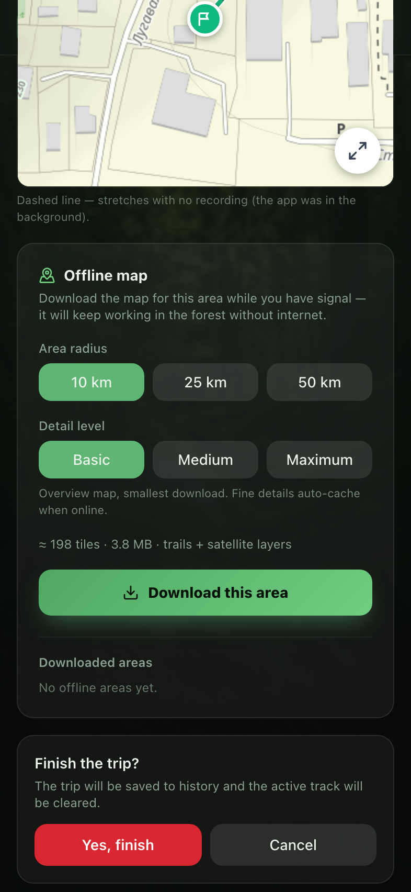

- **Элементы:** «стеклянная» карточка с заголовком `track.finishConfirmTitle`,
  пояснением `finishConfirmBody`, кнопками **Yes, finish** (красная, со спиннером
  при сохранении) и **Cancel**.
- **Логика:** `saveFinishedTrack()` → запись в Supabase (таблица `tracks`,
  миграция `supabase/patch-v43-tracks.sql`); при ошибке/офлайне — fallback в
  `localStorage["sf_track_history"]` с флагом `local: true`. Функция никогда не
  бросает исключение: поход не должен потеряться. Затем активный трек очищается.

### 3.14 История походов

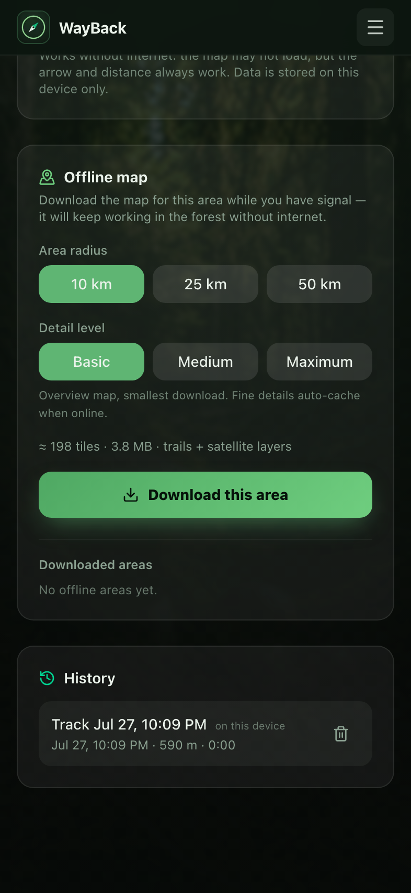

- **Файл:** `src/components/app/TrackHistory.tsx`.
- **Элементы:** заголовок **History** с иконкой; список походов — название
  (или дата), пометка **on this device** для локальных записей, строка
  «дата · расстояние · длительность», корзина. Тап по записи разворачивает карту
  похода (`TrackMap` в режиме просмотра — без «я здесь» и линии возврата).
  Удаление — **в два тапа**: первый переводит кнопку в режим подтверждения на 3 с.
- **Пустое состояние (с v1.41.0):** в WayBack при пустом списке показываются
  заголовок и подсказка `track.historyEmpty` / `historyEmptyHint` — как записать
  первый поход. В SkyForest поведение прежнее: блока нет.
- **Данные:** `src/lib/trackHistory.ts` — Supabase `tracks` + локальный fallback.
  На скриншоте запись помечена **on this device** (сохранилась локально).

### 3.15 Меню (☰)

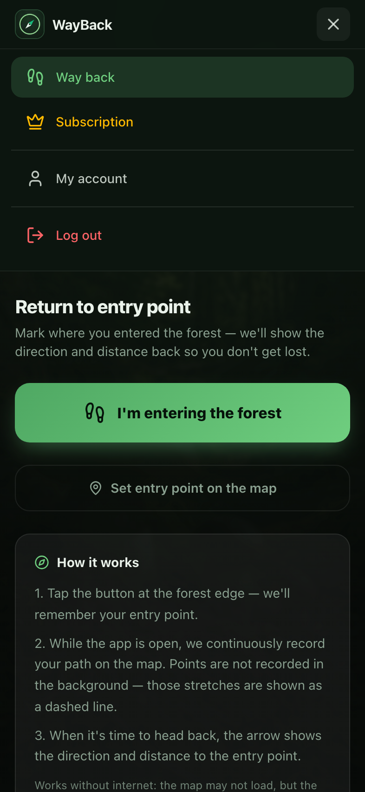

- **Файл:** `src/components/app/AppHeader.tsx` (панель `#app-mobile-nav`).
- **Пункты во флейворе WayBack:** активный раздел трека, **Subscription**
  (`Crown` → `/payment`), **My account** (→ `/account`), **Log out**.
- **Скрыто:** баланс токенов, локации, лучшие дни, чаты, реферальная программа.
- **В вебе** добавляются **RU/EN** и **°C/°F** (последний влияет на единицы
  расстояния в треке — `src/lib/units.ts`).

### 3.16 Пейволл подписки (в приложении)

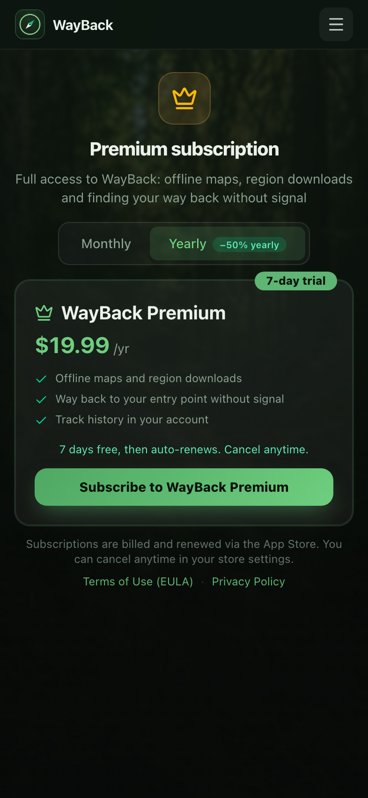
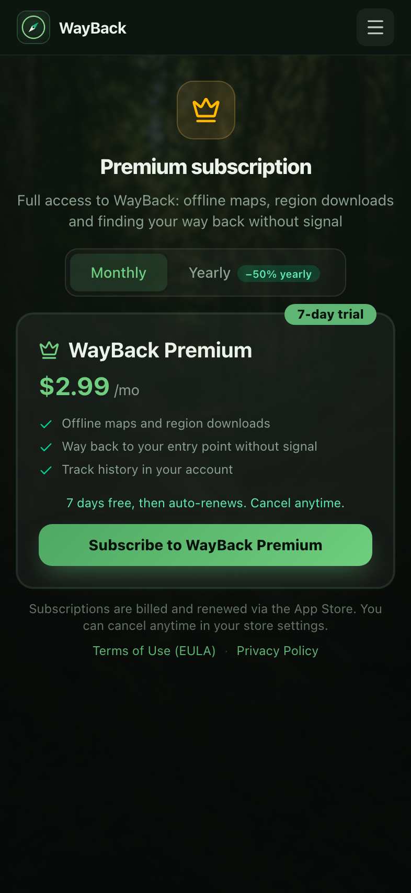

- **Маршрут:** `/payment` · **файл:** `src/app/[locale]/(app)/payment/page.tsx`
  (общий с Checker; при `isFlavored` вся токеновая часть, вывод средств и
  реферальные баннеры скрыты).
- **Элементы:** переключатель **Monthly / Yearly** (на годовом бейдж `−50% yearly`),
  карточка с бейджем **7-day trial**, ценой из стора, тремя фичами
  (`waybackF1..F3`), строкой про 7 бесплатных дней и автопродление, кнопкой
  **Subscribe to …**, сноской о списании через App Store и обязательными ссылками
  **Terms of Use (EULA)** / **Privacy Policy** (App Review 3.1.2).
- **Данные:** `subscriptionProductsForBundle("ai.skyforest.wayback")`
  (`src/lib/native/iapProducts.ts`), цены — `src/lib/native/iap.ts`,
  статус — `GET /api/subscription`.
- **Состояние «подписка активна»:** зелёная карточка с датой окончания и
  кнопкой **Manage subscription** (открывает настройки подписок стора).
- **В браузере** вместо кнопки покупки — пояснение `subscription.webNote`
  («оформление доступно только в приложении»).

### 3.17 Аккаунт

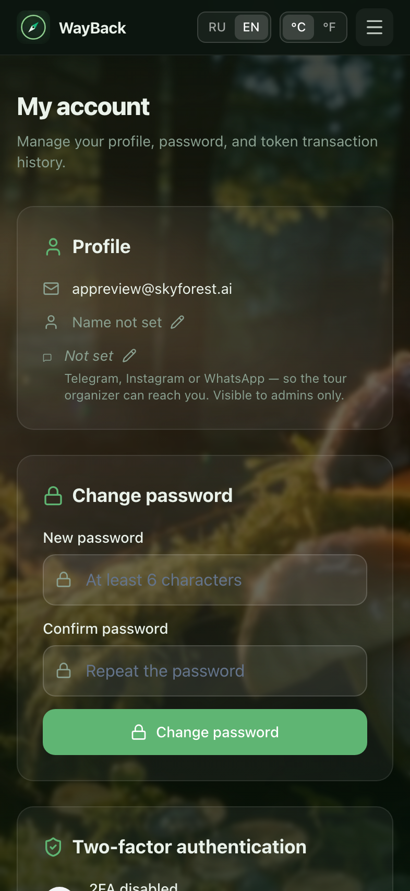

*Снято в браузерной раскладке — см. «Что не удалось снять».*

- **Маршрут:** `/account` · **файл:** `src/app/[locale]/(app)/account/page.tsx`.
- **Карточки:** **Profile** (email, имя — `EditProfileName.tsx`),
  **Subscription** (статус и переход на `/payment`), **Change password**
  (`ChangePassword.tsx`), **Two-factor authentication** (`TwoFactorSetup.tsx`),
  **App Lock** (`src/components/native/BiometricLockSetting.tsx` — только в нативе
  и только при наличии биометрии; флаг в Preferences `biometric_lock_enabled`),
  **Legal** (только в нативе — в вебе ссылки есть в футере), **Delete account**
  (`DeleteAccount.tsx`) с оговоркой, что походы и офлайн-карты на устройстве
  остаются.
- **Данные:** Supabase `profiles` (баланс и транзакции запрашиваются только в
  SkyForest); без сессии — `redirect("/login")`.
- **История:** до v1.41.0 экран целиком повторял SkyForest — с балансом токенов,
  историей транзакций и подзаголовком про токены.

### 3.18 Оферта / EULA и Политика конфиденциальности

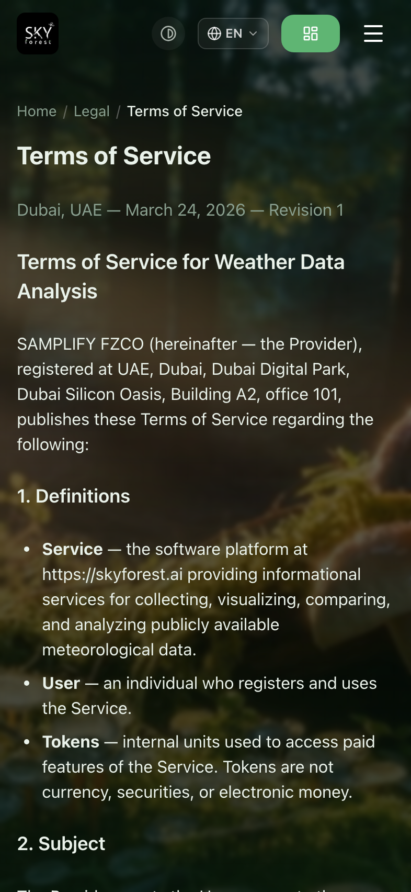
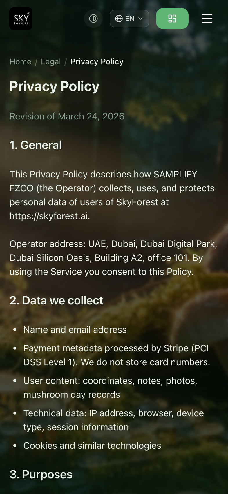

- **Маршруты:** `/offer`, `/privacy` ·
  `src/app/[locale]/(marketing)/offer/page.tsx`, `.../privacy/page.tsx`.
- Открываются из пейволла (обязательное требование сторов) и из футера в вебе.
- **С v1.41.0** документы подставляют название и адрес WayBack, описывают
  подписку вместо токенов и дают свой дисклеймер (вспомогательная навигация, не
  замена карте и компасу); вместо маркетингового header/footer SkyForest —
  компактная оболочка `src/components/marketing/FlavorLegalShell.tsx`.

### 3.19 Удаление аккаунта (публичная страница)

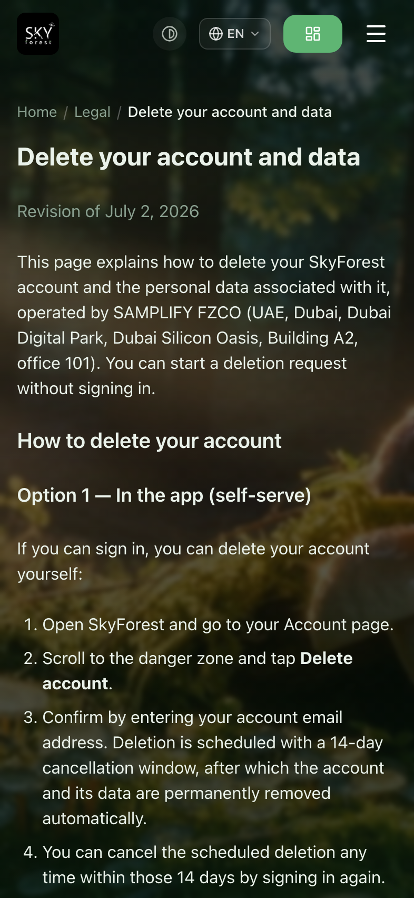

- **Маршрут:** `/delete-account` ·
  `src/app/[locale]/(marketing)/delete-account/page.tsx`.
- Доступна **без входа** (требование сторов): способ 1 — в приложении, с
  14-дневным периодом отмены; способ 2 — письмо в поддержку, до 30 дней.

### 3.20 Чужой маршрут → редирект


- Открыт `/dashboard/identify` (экран Checker) — middleware редиректит на
  `/dashboard/track`. Отдельной страницы «раздел недоступен» нет.

---

## 4. Автономный офлайн-экран нативной оболочки

Отдельный продукт внутри приложения: **чистый HTML + vanilla JS без Next.js**,
который нативная оболочка открывает, когда боевой сайт недоступен (нет сети на
холодном старте). Это единственный экран, который гарантированно работает в походе
при полном отсутствии связи.

- **Файлы:** `mobile/shell/offline-track.html` (разметка + CSS инлайном),
  `mobile/shell/offline-track.js` (~800 строк логики), рядом — локальные копии
  Leaflet.
- **Как получает данные:**
  - активный поход — Capacitor **Preferences**, ключ `sf_active_track`
    (то же значение, что пишет `src/lib/trackState.ts` — благодаря этому якорь,
    поставленный в офлайн-экране, подхватывается приложением и наоборот);
  - тайлы карты — Capacitor **Filesystem** (`directory: "DATA"`), доступ через
    `Capacitor.convertFileSrc`; при наличии сети тайлы дозагружаются и кешируются;
  - позиция — Capacitor **Geolocation** (`watchPosition`), с браузерным fallback
    для отладки;
  - на Android при заданном `server.url` Capacitor не инжектит `native-bridge.js`,
    поэтому в файле есть **собственный шим поверх `androidBridge`**
    (`WebMessageListener`): вызовы плагинов постятся в формате
    `{callbackId, pluginId, methodName, options}`. На iOS `window.Capacitor` есть штатно.
- **Свой i18n:** словари прямо в JS (ru/en), выбор по языку устройства — поэтому
  экран на скриншотах русский, а приложение английское.

### 4.1 Офлайн-экран: похода нет

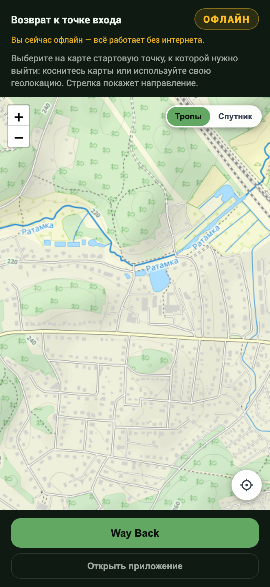

- **Элементы:** заголовок **Возврат к точке входа**, жёлтый бейдж **ОФЛАЙН**,
  строка «Вы сейчас офлайн — всё работает без интернета», инструкция
  («коснитесь карты или используйте свою геолокацию»), карта на весь экран с
  переключателем **Тропы / Спутник**, кнопкой зума ±, кнопкой «моё
  местоположение», нижние кнопки **Way Back** (неактивна, пока не выбрана точка)
  и **Открыть приложение**.
- **id элементов** (для правки стилей): `#t-title`, `#t-offline`, `#t-offlineNote`,
  `#startPane`, `#map`, `#layerSwitch`, `#layerTrails`, `#layerSatellite`,
  `#locateBtn`, `#startBtn`, `#finishBtn`, `#openApp`.

### 4.2 Офлайн-экран: слой «Спутник»

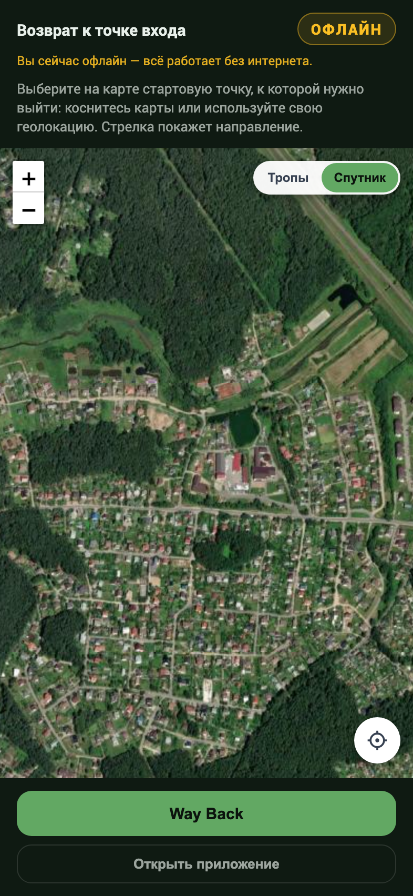

- Переключение между локально скачанными слоями троп и спутника; если тайла нет,
  показывается увеличенный родительский тайл (не пустой квадрат).

### 4.3 Офлайн-экран: точка входа выбрана

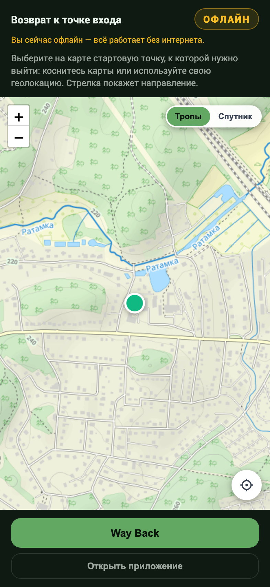

- Тап по карте ставит маркер; кнопка **Way Back** становится активной.

### 4.4 Офлайн-экран: активный поход

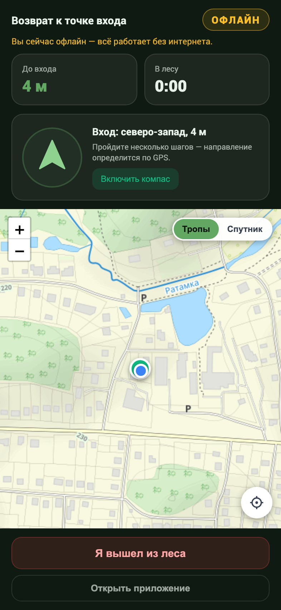

- **Элементы:** плитки **До входа** (расстояние) и **В походе** (время), круглый
  компас со стрелкой, подпись **Вход: северо-запад, 4 м**, подсказка «Пройдите
  несколько шагов…», кнопка **Включить компас**, карта с точкой «я здесь»,
  нижние кнопки **Я вернулся из похода** (красная) и **Открыть приложение**.
- Разметка сознательно повторяет экран трека в приложении, но реализована
  вручную — при редизайне **эти стили придётся править отдельно**, они не
  наследуют ни Tailwind, ни `globals.css`.

---

## 5. Сквозные флоу (пошагово)

### 5.1 Регистрация и вход (email / Google / Apple)

1. Холодный старт → нативный splash + `NativeSplash`.
2. `NativeAppProvider` ведёт на `/dashboard/track` — **вход не требуется**,
   приложением можно пользоваться сразу.
3. Вход нужен для подписки, `/account` и синхронизации истории: меню **☰** →
   **My account** / **Subscription** → при отсутствии сессии middleware отправит
   на `/login?redirect=...`.
4. **Continue with Google / Continue with Apple** → `signInWithOAuth`, в нативе
   системный браузер, возврат по deep link на `/auth/callback`
   (`src/app/auth/callback/route.ts`).
5. Либо email + пароль (`signInWithPassword`); при подтверждённом TOTP —
   `/verify-mfa` → 6 цифр → `mfa.challengeAndVerify`.
6. После входа локальная история может быть синхронизирована в Supabase
   (`tracks`); записи, оставшиеся локальными, помечены **on this device**.

### 5.2 Поход: старт → запись пути → возврат → завершение → история

1. `/dashboard/track` → **I'm heading outdoors**.
2. `getCurrentPosition()` (`src/lib/native/geolocation.ts`): в нативе
   Capacitor Geolocation, в браузере — Web Geolocation API.
3. Успех → `startTrack(pos)`: якорь в `localStorage["sf_active_track"]` +
   зеркало в Capacitor Preferences. Экран переключается в режим активного похода.
4. Неудача GPS → тост `track.geoErrorPick` и автоматически открывается
   **ручной выбор точки на карте** → **I entered here**.
5. `TrackRecorder` пишет точки всё время похода, в том числе со свёрнутым
   приложением и погашенным экраном; при возврате в приложение делается
   внеочередной замер. Промежутки без записи показываются на карте **пунктиром**
   (в сборках 1.1 и новее это отсутствие спутников, в более старых — фон).
6. Направление возврата: курс движения по GPS (приоритет) → магнитометр
   (**Enable compass**) → текст со стороной света. Расстояние — `haversineM`,
   азимут — `bearingDeg` (`src/lib/trackState.ts`).
7. **I'm back from outdoors** → карточка подтверждения → **Yes, finish**.
8. `saveFinishedTrack()`: Supabase `tracks`, при ошибке — `localStorage`
   (`sf_track_history`, флаг `local`). Тост об успехе (`savedToast` /
   `savedLocalToast`), активный трек очищается, поход появляется в **History**.

### 5.3 Офлайн-сценарий: скачать регион → авиарежим → холодный старт

1. **Пока есть сеть:** `/dashboard/track` → **Offline map** → **Use my location**
   → радиус (10/25/50 км) → детализация (Basic/Medium/Maximum) → проверить
   оценку «≈ N tiles · M MB» → **Download this area**.
2. Тайлы обоих слоёв (тропы + спутник) сохраняются в Capacitor Filesystem;
   прогресс с возможностью **Cancel**; результат — участок в **Downloaded areas**.
3. **Авиарежим / нет сети, приложение уже запущено:** карта берёт тайлы из
   локального кеша (`OfflineTileLayer`), при отсутствии нужного зума показывает
   растянутый родительский тайл; стрелка и расстояние считаются на устройстве и
   работают всегда.
4. **Холодный старт без сети:** боевой сайт не открывается → нативная оболочка
   показывает `mobile/shell/offline-track.html` (errorPath / локальный fallback).
5. Офлайн-экран читает `sf_active_track` из Preferences: если поход был начат в
   приложении — он продолжается со всеми данными; если нет — точку входа можно
   поставить тапом по карте и нажать **Way Back**.
6. Поход, начатый/завершённый в офлайн-экране, попадает в те же Preferences;
   при следующем запуске приложения `hydrateTrackFromNative()` поднимает его в
   localStorage — состояние не теряется.
7. Кнопка **Открыть приложение** пробует перейти на боевой сайт (когда сеть вернулась).

### 5.4 Оформление подписки с 7-дневным триалом

1. Меню **☰** → **Subscription** → при отсутствии сессии сначала вход.
2. `initIap()` поднимает StoreKit / Play Billing и подтягивает локальные цены.
3. Выбор **Monthly / Yearly** (год со скидкой −50 %).
4. **Subscribe to WayBack Premium** → системный диалог стора; 7 дней бесплатно,
   далее автопродление.
5. Чек уходит на бэкенд; `GET /api/subscription` начинает отдавать активную
   подписку → карточка меняется на **Subscription active until …**.
6. Отмена/управление — только через настройки стора (**Manage subscription**).
7. В браузере покупка недоступна: показывается состав тарифа и пояснение
   `subscription.webNote`.

### 5.5 Удаление аккаунта

1. `/account` → **Delete account** → модалка (`DeleteAccount.tsx`) с вводом email.
2. Удаление планируется, даётся **14 дней на отмену** (достаточно снова войти).
3. По истечении срока аккаунт и серверные данные удаляются безвозвратно.
4. Без входа — `/delete-account`: письмо в поддержку, обработка до 30 дней.
5. ⚠️ **Важно для WayBack:** локальная история походов
   (`localStorage["sf_track_history"]`, Preferences) удалением аккаунта **не
   затрагивается** — она живёт на устройстве. Это стоит явно объяснить в UI.

---

## 6. Что важно сохранить при редизайне

- **Анонимный режим — сердце продукта.** `/dashboard/track` обязан работать без
  сессии (`FLAVORS.wayback.anonymousPaths`). Любой новый обязательный экран
  «сначала зарегистрируйтесь» сломает главное преимущество.
- **Всё считается на устройстве.** Расстояние и азимут (`haversineM`,
  `bearingDeg`, `courseOverGround`) не зависят от сети; активный поход — в
  `localStorage["sf_active_track"]` **и** в Capacitor Preferences (ключ общий с
  офлайн-экраном оболочки). Менять ключ или формат нельзя без правки
  `mobile/shell/offline-track.js`.
- **Офлайн-экран оболочки — отдельная кодовая база.** Vanilla JS + инлайн-CSS,
  без Tailwind и `globals.css`, со своим i18n и собственным шимом Capacitor для
  Android. Любой редизайн трека нужно повторять здесь **вручную**, иначе
  приложение в походе будет выглядеть иначе, чем в городе.
- **Приоритет источников направления** (GPS-курс → магнитометр → текст) и
  пунктир для промежутков без записи — не косметика, а объяснение того, почему
  стрелка иногда «не знает» направление. Нельзя убирать подсказки
  `courseHint` / `compassHint` / `gapHint` / `moveToDetect`.
- **Честная оценка размера скачивания** («≈ N tiles · M MB») до старта загрузки и
  возможность отмены — критично: люди качают карты в роуминге и на мобильном трафике.
- **Ветка `isNative`.** `/login` содержит две вёрстки, `AppShell` меняет фон
  (видео → статичное фото), футер и отступы; таб-бар скрыт, потому что раздел один.
- **Safe-area и тач-таргеты.** `pt-[env(safe-area-inset-top)]`,
  `pb-[calc(4.75rem+env(safe-area-inset-bottom))]`, кнопки 52–72 px по высоте.
  Главная кнопка старта должна оставаться крупной: её нажимают в походе, в перчатках.
- **Тёмная тема и брендовые цвета.** `colorScheme: dark`, акцент — зелёный
  `--color-primary: #5fb573` / `--color-primary-light: #6fce7f`; переменные,
  `.glass`, `.btn-primary` и тема высокой контрастности (`html[data-theme="hc"]`)
  живут в `src/app/globals.css` (Tailwind v4, блок `@theme inline`;
  отдельного `tailwind.config.ts` нет).
- **`backdrop-filter` в `.glass` — дорогой** для мобильных WebView (и причина,
  по которой headless Chromium не отдаёт кадр на `/account`). Слоёв блюра лучше
  становиться меньше, а не больше.
- **Единицы измерения.** Расстояние форматируется через `src/lib/units.ts`
  (`fmtDistanceM`) с учётом переключателя метрической/имперской системы.
- **Обязательные для сторов элементы:** ссылки **Terms of Use (EULA)** и
  **Privacy Policy** в покупке, текст про автопродление и отмену, доступная без
  входа страница `/delete-account`, отсутствие промокодов в нативе (Apple 3.1.1).
- **i18n только через `next-intl`** (`src/i18n/messages/track.{ru,en}.ts` и др.);
  у офлайн-экрана — свой словарь внутри `offline-track.js`.

### Что стоит исправить (найдено при съёмке)

Пункты 1–4 закрыты в v1.41.0 — оставлено как история находок:

1. ~~Splash и экран входа используют брендинг SkyForest.~~ Splash, вход,
   регистрация, восстановление пароля и экран блокировки берут иконку-компас,
   название и таглайн из флейвора (`useFlavorBrand`, `AuthBrandMark`).
2. ~~Ручной выбор точки входа без GPS-фикса открывает карту мира.~~ Центр
   подбирается по цепочке: текущая позиция → последняя известная позиция
   устройства → якорь активного похода → скачанный офлайн-регион → обзорный вид
   сервиса.
3. ~~`/account` унаследован целиком от SkyForest.~~ Баланс и история токенов,
   бот и рефералка скрыты, добавлена карточка подписки и юридические ссылки
   (в нативной оболочке, где нет футера).
4. ~~У истории походов нет пустого состояния.~~ Пустая история показывает
   заголовок и подсказку, как записать первый поход (только в WayBack).
5. Из анонимного режима нет явного приглашения войти/оформить подписку — не
   исправлено, требует продуктового решения.

---

## 7. Файлы, которые придётся править при редизайне

**Экраны (страницы):**

- `src/app/[locale]/(app)/dashboard/track/page.tsx` — главный экран (idle + активный поход)
- `src/app/[locale]/(app)/payment/page.tsx` — пейволл подписки (общий с Checker)
- `src/app/[locale]/(app)/account/page.tsx` — аккаунт
- `src/app/[locale]/(auth)/login/page.tsx` · `register` · `forgot-password` ·
  `reset-password` · `verify-mfa`
- `src/app/[locale]/landing/wayback/page.tsx` — посадочная
- `src/app/[locale]/(marketing)/offer/page.tsx` · `privacy` · `delete-account`

**Компоненты трека и карт:**

- `src/components/app/TrackMap.tsx` — карта похода, слои, полноэкранный режим
- `src/components/app/StartPointPicker.tsx` — ручной выбор точки входа
- `src/components/app/TrackHistory.tsx` — история походов
- `src/components/app/OfflineMapManager.tsx` — скачивание регионов
- `src/components/app/RegionPreview.tsx` — предпросмотр региона
- `src/components/app/OfflineTileLayer.tsx` — слой тайлов с офлайн-кешем

**Оболочка и навигация:**

- `src/components/app/AppShell.tsx` — фон, `<main>`, футер/таб-бар
- `src/components/app/AppHeader.tsx` — шапка и меню ☰
- `src/components/native/NativeTabBar.tsx` (в WayBack скрыт),
  `NativeSplash.tsx`, `UpdatePrompt.tsx`, `NativeOnly.tsx`
- `src/components/marketing/Footer.tsx` — веб-футер

**Компоненты аккаунта:**

- `src/components/app/ChangePassword.tsx`, `TwoFactorSetup.tsx`,
  `EditProfileName.tsx`, `EditContactLink.tsx`, `TransactionHistory.tsx`,
  `DeleteAccount.tsx`
- `src/components/native/BiometricLockSetting.tsx`
- `src/components/auth/SocialLoginButtons.tsx`

**Автономный офлайн-экран (правится отдельно!):**

- `mobile/shell/offline-track.html` — разметка и **все стили инлайном**
- `mobile/shell/offline-track.js` — логика, свой i18n, шим Capacitor для Android
- `mobile/shell/` — локальные копии Leaflet и ассетов

**Логика и данные:**

- `src/lib/trackState.ts` — активный трек, ключ `sf_active_track`, гео-формулы
- `src/lib/trackRecorder.ts` — запись точек (`watchPosition`, событие `sf:track-capture`)
- `src/lib/trackHistory.ts` — история (Supabase `tracks` + `sf_track_history`)
- `src/lib/trackGeo.ts` — гео-формулы (мини-копия продублирована в офлайн-экране)
- `src/lib/offline/tileStore.ts` — источники тайлов, оценка размера, загрузка, удаление
- `src/lib/native/geolocation.ts` — позиция (Capacitor / Web API)
- `src/lib/units.ts` — форматирование расстояний
- `src/lib/appFlavor.ts`, `src/lib/useAppFlavor.ts`, `src/middleware.ts` — маршруты флейвора
- `src/lib/native/iapProducts.ts`, `src/lib/native/iap.ts` — подписка

**Стили:**

- `src/app/globals.css` — тема (Tailwind v4, `@theme inline`), `.glass`,
  `.btn-primary`, анимации, тема высокой контрастности

**i18n:**

- `src/i18n/messages/track.{ru,en}.ts` (включая все подсказки офлайн-карты),
  `subscription.*`, `auth.*`, `account.*`, `appHeader.*`, `common.*`
- `src/i18n/routing.ts`, `src/i18n/brand-locale.ts`, `src/i18n/navigation.ts`

**PWA / иконки:**

- `public/manifest-wayback.webmanifest`, `public/icons/wayback-*.png`
  (в том числе `wayback-512.png` — splash и экраны входа),
  `public/images/app-bg-forest.png` (фон)

> Нативные проекты (`apps/`, `ios/`, `android/`, `fastlane/`) в этой задаче не
> трогались. Важно помнить: оболочка лишь открывает боевой сайт в WebView, а при
> отсутствии сети — локальный `offline-track.html`.

---

## 8. Как перезаснять скриншоты

```bash
cd skyforest
node scripts/capture-ui-flows.mjs wayback           # основной набор + анонимный трек
node scripts/capture-ui-flows.mjs wayback-active    # активный поход (15–17)
node scripts/capture-ui-flows.mjs wayback-history   # проходит поход целиком → история (14)
node scripts/capture-ui-flows.mjs shell             # офлайн-экран оболочки (30–33)
node scripts/capture-ui-flows.mjs menu              # раскрытое меню ☰
```

Учётные данные демо-аккаунта — `UI_FLOWS_EMAIL` / `UI_FLOWS_PASSWORD`,
хост — `UI_FLOWS_WAYBACK`. Реестр снятых экранов — `docs/ui-flows/manifest.json`.

### Что не удалось снять и почему

- **`/account` в нативной раскладке.** В симуляции нативной оболочки
  (Capacitor-мок в обычном Chromium) рендерер этой страницы после гидрации
  перестаёт отдавать кадры: зависают и `page.screenshot`, и CDP
  `Page.captureScreenshot`, и любой `evaluate`. Проверено в headless и headed
  режимах, с GPU-флагами, с отключёнными анимациями и `backdrop-filter`,
  без WebAuthn — не помогает; в web-режиме та же страница снимается за ~250 мс.
  Поэтому скриншот сделан в браузерной раскладке: содержимое карточек идентично,
  отличается оболочка. На реальном устройстве экран работает нормально.
- **Компас со стрелкой в приложении.** Playwright подменяет только координаты,
  а `deviceorientation` не эмулируется, и «шаги» слишком короткие для устойчивого
  GPS-курса, поэтому на скриншотах активного похода видно состояние
  «направление определяется» с кнопкой **Enable compass**, а не повёрнутая
  стрелка. Стрелка в круге показана на скриншоте офлайн-экрана (33).
- **Полностью скачанный офлайн-регион и предпросмотр региона.** Загрузка 198
  тайлов с боевых источников в CI-режиме заняла бы минуты и нагрузила бы
  тайл-серверы, поэтому снят только прогресс; список **Downloaded areas** показан
  в пустом состоянии.
- **Экраны, требующие реального устройства:** системный диалог покупки App Store,
  диалог Face ID для **App Lock**, `UpdatePrompt` (нужен новый билд в сторе),
  OAuth-страницы Google/Apple, реальный переход оболочки на офлайн-экран
  (снят с локального статик-сервера).
- **`/verify-mfa`** — у демо-аккаунта не включён TOTP, экран недостижим.
